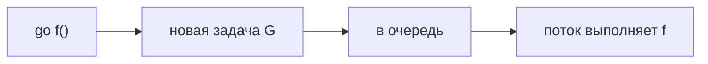
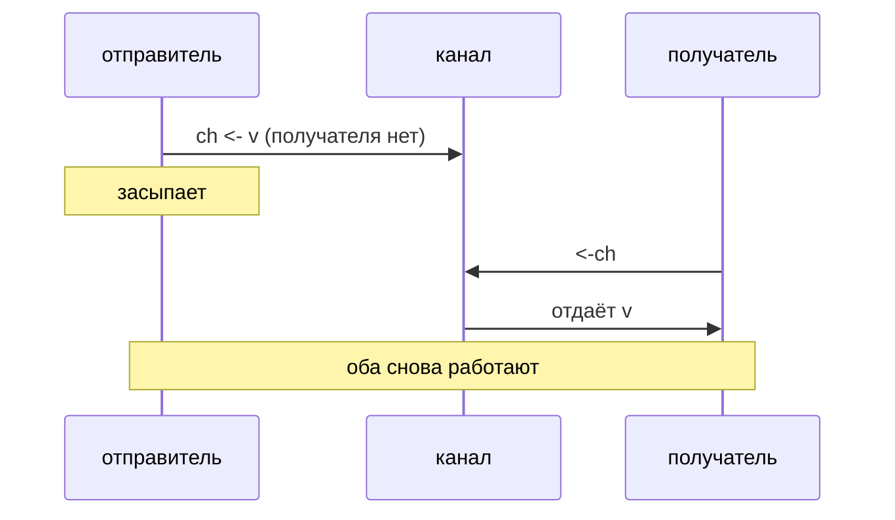

# Основы конкурентности: горутины и каналы

Конкурентность в Go встроена в язык. Базовая модель: **горутины** — легковесные единицы выполнения, **каналы** — способ безопасно передавать данные между ними.

Конкурентность ≠ параллелизм.

Конкурентность — про структуру программы (много задач одновременно в полёте), параллелизм — когда они реально бегут на разных ядрах. Планировщик Go раскидывает горутины по OS-потокам.

## Горутины

Горутина запускается словом `go` перед вызовом функции:

```go
go f(x, y, z)
```

Аргументы вычисляются в текущей горутине, а сама `f` уже бежит в новой. Горутины дешёвые: можно запускать тысячи, стек растёт по необходимости.

```go
func say(s string) {
    for i := 0; i < 5; i++ {
        time.Sleep(100 * time.Millisecond)
        fmt.Println(s)
    }
}

func main() {
    go say("world")
    say("hello")
}
```

Важный нюанс: `main` тоже горутина. Когда `main` заканчивается, программа завершается, **не дожидаясь** остальных. Поэтому «запустил горутину и забыл» — ошибка. Дождаться можно через канал, `sync.WaitGroup` или `context`.

## Каналы

Канал — типизированная «труба» между горутинами. Создаётся через `make`:

```go
ch := make(chan int)
```

### Send и receive

Это две операции с каналом.

**Send** — отправить в канал:

```go
ch <- value
```

Читается: «положи `value` в `ch`». Кто пишет — **sender** (отправитель).

**Receive** — получить из канала:

```go
value := <-ch
// или просто
<-ch
```

Читается: «возьми значение из `ch`». Кто читает — **receiver** (получатель).

Стрелка `<-` показывает направление относительно канала:

```text
ch <- v   // значение идёт В канал   (send)
v := <-ch // значение идёт ИЗ канала (receive)
```

По умолчанию канал **небуферизованный**: send и receive блокируются, пока другая сторона не готова. Это и обмен данными, и точка синхронизации (рандеву).

```go
func sum(s []int, c chan int) {
    total := 0
    for _, v := range s {
        total += v
    }
    c <- total
}

func main() {
    s := []int{7, 2, 8, -9, 4, 0}
    c := make(chan int)
    go sum(s[:len(s)/2], c)
    go sum(s[len(s)/2:], c)
    x, y := <-c, <-c
    fmt.Println(x, y, x+y)
}
```

Первая половина `s[:3]` → `{7, 2, 8}` → сумма **17**.  
Вторая `s[3:]` → `{-9, 4, 0}` → сумма **-5**.

Вывод: `17 -5 12` или `-5 17 12` — порядок `x` и `y` не гарантирован (кто из горутин раньше успеет отправить), сумма всегда **12**.

Направление можно сузить в сигнатуре:

```go
func produce(out chan<- int) { // только send
    out <- 42
}

func consume(in <-chan int) { // только receive
    v := <-in
    fmt.Println(v)
}
```

- `chan<- int` — только отправка
- `<-chan int` — только получение
- `chan int` — и то и другое

Так компилятор не даст получателю случайно писать не туда, а по коду видно, кто владеет каналом.

## Буферизованные vs небуферизованные каналы

### Небуферизованный

```go
ch := make(chan int) // буфер = 0
```

Send и receive — **рандеву**: оба должны быть готовы одновременно.

- `ch <- 1` **ждёт**, пока кто-то сделает `<-ch`
- `<-ch` **ждёт**, пока кто-то сделает `ch <- ...`

Когда send **вернулся** — значение уже забрали. Это и обмен, и синхронизация.

### Буферизованный

```go
ch := make(chan int, 3) // буфер на 3 значения
```

Есть очередь на N мест.

- send **не ждёт** получателя, пока в буфере есть место;
- receive **не ждёт** отправителя, пока в буфере что-то есть;
- send блокируется, только когда буфер **полон**;
- receive блокируется, только когда буфер **пуст**.

Когда send вернулся — значение может ещё лежать в буфере, получатель его ещё не взял. Буфер развязывает скорости producer/consumer.

### Когда что брать

| Нужно                                          | Канал                    |
| ---------------------------------------------- | ------------------------ |
| «Я отдал — ты точно принял» (handshake)        | **небуферизованный**     |
| Сигнал done / синхронизация без очереди        | **небуферизованный**     |
| Producer быстрее consumer, сгладить пики       | **буферизованный**       |
| Очередь задач с лимитом «не больше N в полёте» | **буферизованный**       |
| Semaphore: не больше K одновременных операций  | `make(chan struct{}, K)` |

Одной фразой:

- **без буфера** — встретились и передали;
- **с буфером** — положили в очередь и пошли дальше (пока очередь не полная).

### Мини-пример

```go
// небуферизованный: main ждёт, пока горутина реально отправит
ch := make(chan string)
go func() {
    ch <- "готово" // send
}()
msg := <-ch // receive — тут main «встречается» с горутиной
fmt.Println(msg)

// буферизованный: send не блокируется, пока есть место
buf := make(chan int, 2)
buf <- 1 // send, ок
buf <- 2 // send, ок
// buf <- 3 // заблокируется: буфер полон, нет receive
fmt.Println(<-buf, <-buf) // receive, receive
```

## Close и `range`

Закрывает канал обычно **отправитель** (не получатель):

```go
close(ch)
```

Получатель проверяет:

```go
v, ok := <-ch // ok == false, если канал закрыт и пуст
```

Удобный обход, пока канал не закроют:

```go
for v := range ch {
    fmt.Println(v)
}
```

Отправка в закрытый канал — panic. Повторный `close` — тоже. Закрытие канала часто используют как сигнал «работы больше не будет» (done-канал).

## Select

`select` ждёт готовности **одного** из нескольких case с каналами (как `switch`, но для коммуникаций):

```go
select {
case msg := <-ch1:
    fmt.Println(msg)
case ch2 <- x:
    fmt.Println("sent")
case <-time.After(1 * time.Second):
    fmt.Println("timeout")
}
```

Если готовы несколько case — выбирается случайный. Если ни один не готов — `select` блокируется, пока кто-то не станет готов. Ветка `default` делает операцию неблокирующей: «если сейчас никто не готов — идём дальше».

Так пишут таймауты, multiplex нескольких источников, отмену через `<-ctx.Done()` рядом с рабочей операцией.

## Happens-before и memory model

Отсутствие одновременного выполнения «на глаз» не гарантирует видимость записей между горутинами. Связь **happens-before** означает: все записи до синхронизирующего события гарантированно видны после соответствующего события в другой горутине.

Основные примеры:

- send в канал happens-before завершения соответствующего receive;
- закрытие канала happens-before receive, который увидел закрытие;
- `Mutex.Unlock` happens-before последующего успешного `Mutex.Lock`;
- завершение `Once.Do(f)` happens-before возврата других вызовов `Do`;
- атомарные операции дают гарантии, описанные пакетом `sync/atomic`.

Если две горутины обращаются к одной памяти, хотя бы одна пишет и между ними нет синхронизации, это data race. Проверять нужно `go test -race`, но detector обнаруживает только реально исполненные пути.

## Nil-канал как выключенный case

Send и receive из nil-канала блокируются навсегда. В обычном коде это часто ошибка, но внутри `select` nil-канал удобно временно отключает ветку:

```go
var out chan int

if ready {
    out = realOutput
}

select {
case out <- value: // выключено, пока out == nil
case <-ctx.Done():
}
```

## Как устроена горутина внутри (глубже, но проще)

`go f()` в коде — одна строка. Под капотом runtime создаёт **новую задачу** (внутри её называют **G**) и ставит в очередь «кто следующий на CPU».

**Горутина — это не поток ОС.** Поток ОС тяжёлый; горутин может быть тысячи, а потоков — десятки. Планировщик раскидывает задачи по потокам. Подробнее — [14. Планировщик GMP](./14.%20Планировщик%20GMP.md).

### Свой стек

У каждой горутины свой **стек** — память под локальные переменные и вызовы функций.

- В начале он **маленький** (несколько КБ), не мегабайты как у потока ОС.
- **Растёт**, если функций много или данные большие.
- Иногда **уменьшается**, если верх стека не нужен.

Поэтому `go` дёшев: не поднимаем новый поток ОС, а только новую задачу с маленьким стеком.

### В каком состоянии может быть горутина

Runtime помечает каждую горутину. Достаточно четырёх слов:

| Состояние | Простыми словами |
|-----------|------------------|
| **работает** | сейчас выполняется на CPU |
| **готова** | может работать, ждёт очереди |
| **ждёт** | заблокирована: канал, mutex, sleep, сеть… |
| **закончилась** | функция вернулась, задача мёртва |

Пример: `<-ch` на пустом канале → горутина **ждёт**. Поток при этом **не простаивает** — runtime переключается на другую горутину. Так и получается «много задач на нескольких потоках».

### Что делает `go f()`

1. Берёт свободную горутину из пула (или создаёт новую).
2. Говорит: «выполни `f` с этими аргументами» (аргументы уже посчитаны **до** `go`).
3. Кладёт задачу в **очередь** планировщика.
4. Когда подойдёт очередь — поток выполнит `f`.



**Помни:** `main` — тоже горутина. Закончился `main` → программа завершилась, остальные горутины **убиваются**. «Запустил и забыл» — плохая идея.

## Как устроен канал внутри (глубже, но проще)

`chan int` в коде — это тип. В памяти за ним лежит **структура канала** (в runtime её называют `hchan` — можно не запоминать, смысл важнее).

У канала по сути есть:

| Часть | Зачем |
|-------|--------|
| **буфер** | очередь значений (если канал с буфером) |
| **очередь ждущих отправителей** | кто делал `ch <-`, но некому передать |
| **очередь ждущих получателей** | кто делал `<-ch`, но нечего читать |
| **флаг «закрыт»** | канал уже закрыли |

Канал — не «труба в ядре Linux». Это **обычный объект в памяти программы** + правила: кого поставить ждать, когда разбудить.

### Небуферизованный канал

`make(chan T)` — без буфера.

**Отправка `ch <- v`:**
- получателя **нет** → отправитель **засыпает** (встаёт в очередь ждущих отправителей);
- получатель **уже ждёт** → значение **сразу** передаётся ему, оба идут дальше.

**Получение `<-ch`** — наоборот: ждёт отправителя или сразу забирает при handoff.

Отсюда «встреча»: send и receive должны **сойтись**, часто без промежуточного хранения.



### Буферизованный канал

`make(chan T, N)` — внутри кольцевая очередь на N мест.

- **send**: есть место → кладёт в буфер, **не ждёт**;
- **send**: буфер полон → засыпает;
- **receive**: в буфере есть данные → забирает;
- **receive**: буфер пуст → засыпает.

Producer может «накидать» в очередь и идти дальше, пока есть место — скорости не связаны жёстко.

### Как runtime «запоминает», кто ждёт

Когда горутина ждёт на канале, runtime вешает на неё маленькую **запись-ожидание**: «эта горутина ждёт send/receive на этом канале». Очереди ждущих отправителей и получателей — списки таких записей.

Пока горутина ждёт — она **не ест CPU**. Когда условие выполнилось (пришёл парный send/receive, освободилось место) — её **будят** и снова ставят в очередь на работу.

### `close(ch)` изнутри

`close`:
- помечает канал закрытым;
- **будит** всех, кто ждал;
- читатель получит нулевое значение и `ok == false`;
- **send в закрытый канал — panic**.

Закрывает **отправитель** — «больше данных не будет». Два `close` или send после close — panic.

### `select` изнутри

`select` runtime обрабатывает так: смотрит все `case`, может **сразу повесить** текущую горутину на несколько каналов и ждать, пока **хотя бы один** станет готов.

- готов один case → выполняется он;
- готовы несколько → **случайный** выбор (чтобы один case не забирал всё);
- есть `default` → не ждём, если никто не готов.

Поэтому удобно: `<-ctx.Done()` рядом с `<-ch` — отмена или работа.

## Как это связано с планировщиком

```text
go f()        →  новая горутина в очереди
ch <- / <-    →  горутина может «заснуть» на канале
                 поток в это время крутит другую
                 канал готов → горутину будят
```

Каналы **не заменяют** mutex. Для счётчика или общей map часто проще `sync.Mutex`. Каналы хороши для **передачи данных** и явного «я отдал — ты принял». Но и каналы, и mutex внутри используют одно: **уснуть / разбудить горутину** через планировщик.

## Что спрашивают на собесе

**Чем горутина отличается от потока?**  
Горутина — лёгкая задача, маленький стек. Поток ОС — тяжёлый. Много горутин на меньшем числе потоков.

**Почему небуферизованный канал синхронизирует?**  
Send и receive ждут друг друга — это «встреча» через runtime.

**Читать из nil-канала?**  
Зависнешь навсегда. В `select` case с nil-каналом **игнорируется**.

**Send в закрытый канал?**  
Panic — получатели уже не ждут новых данных.

**Куда копать дальше?**  
[14. Планировщик GMP](./14.%20Планировщик%20GMP.md). В исходниках Go: `runtime/proc.go`, `runtime/chan.go`.

## Видео для закрепления

- [Почему Go так быстрый? Горутины, каналы и конкурентность](https://www.youtube.com/watch?v=FlVGvwQEpCA) — рус. Обзорная картина: зачем горутины и каналы и как ими мыслить.
- [Анатомия Go: планировщик горутин](https://www.youtube.com/watch?v=kedW1xO3Zbo) — рус. Николай Тузов, глубже под капот (после базы из тура).
