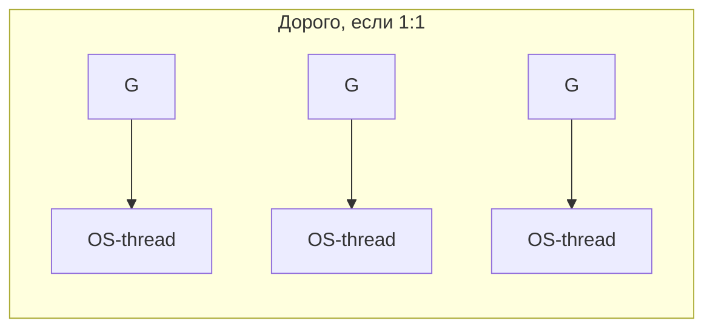
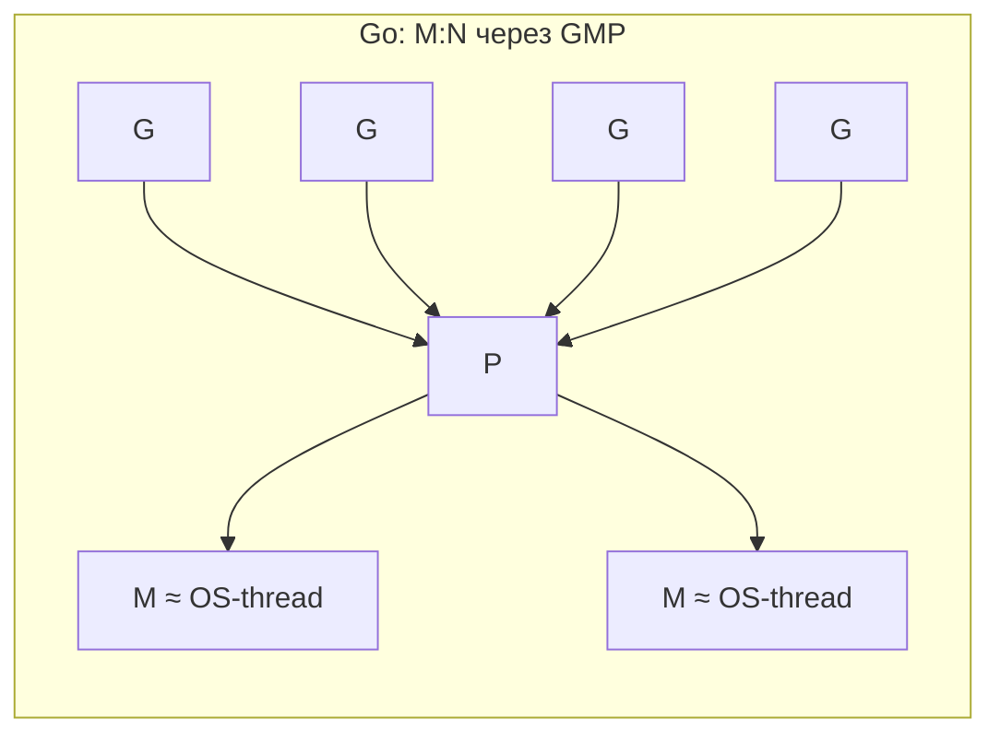
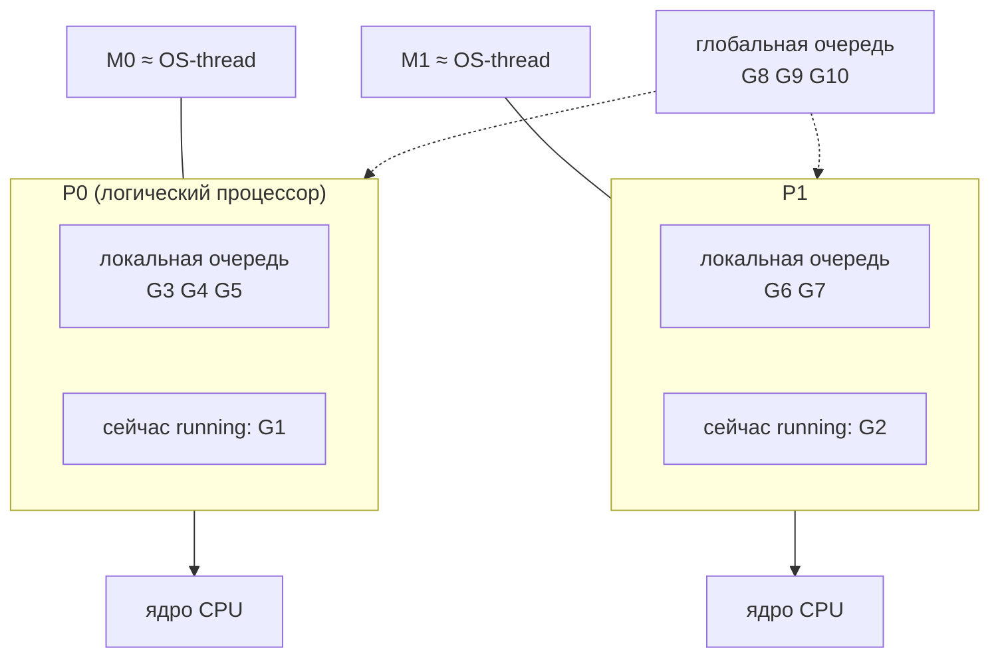
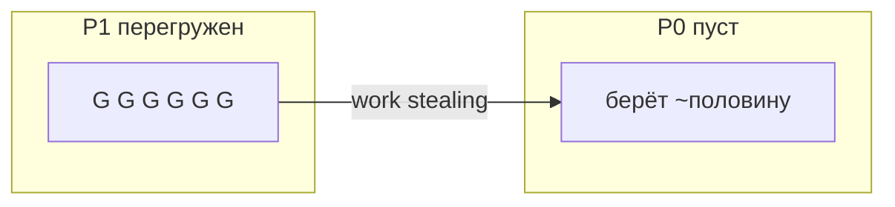
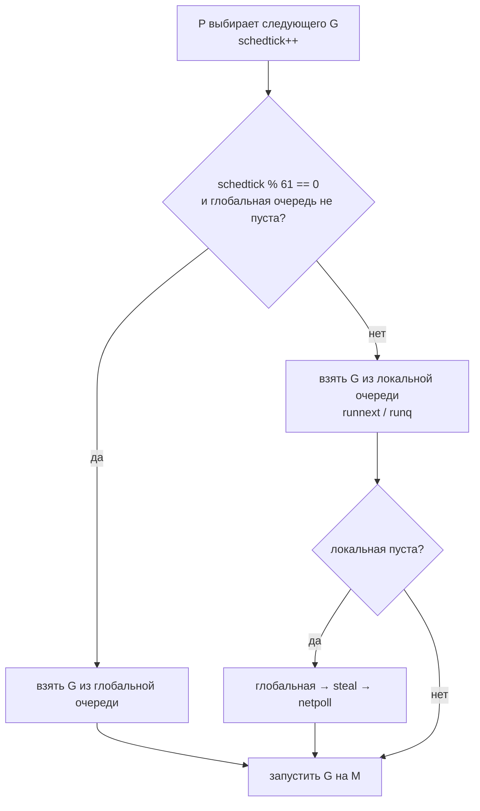
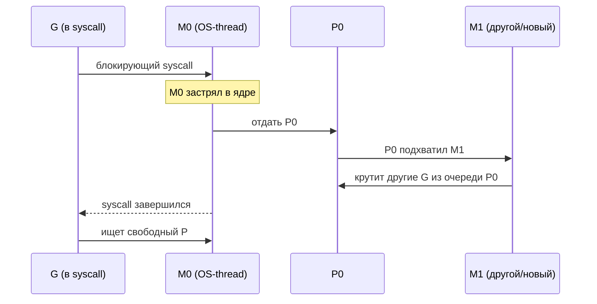
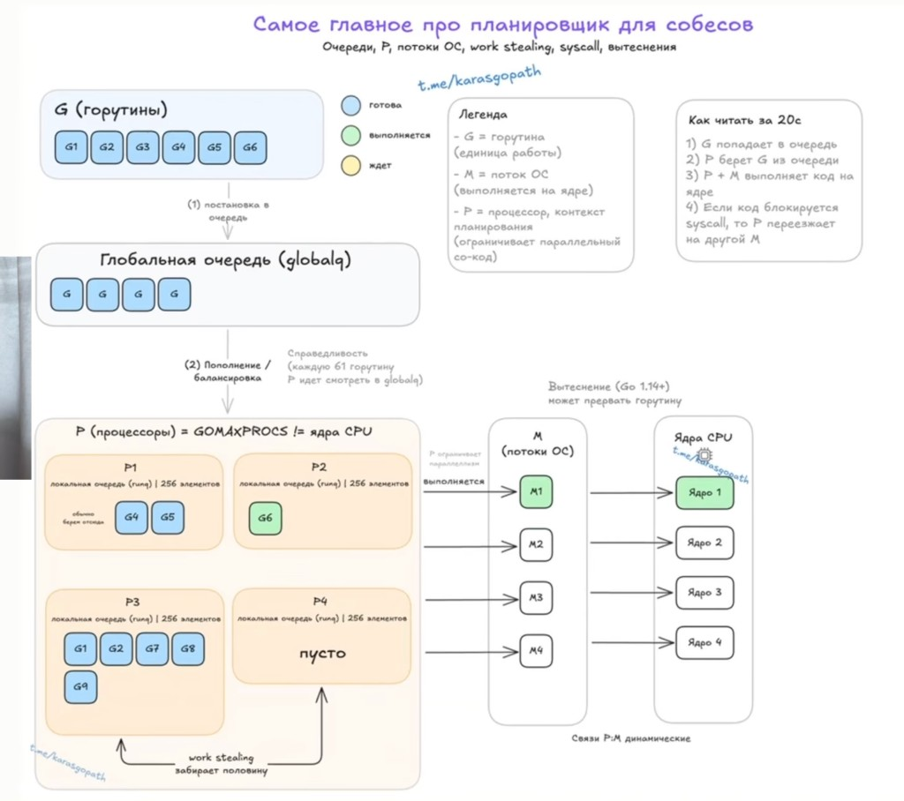

# Планировщик GMP

Тема уже не из [A Tour of Go](https://go.dev/tour/) — это внутренности runtime. На собесесах её часто спрашивают после горутин и каналов: «как Go раскидывает тысячи горутин на потоки ОС?».

Коротко: Go использует модель **M:N** — много горутин (N) мультиплексируются на меньшее число OS-потоков (M). С Go 1.1 в эту схему добавили третью сущность **P**, и модель стали называть **GMP**: Goroutine, Machine, Processor.

## Что такое OS-thread

**OS-thread** (поток операционной системы) — единица выполнения, которой управляет **ядро ОС** (Linux / macOS / Windows). Именно ОС решает, на каком ядре CPU поток сейчас крутится. У потока свой стек (обычно мегабайты), регистры и идентификатор в ядре; создание и переключение относительно дорогие.

Это важно для GMP: горутина сама по себе потоком ОС **не является**. На CPU код исполняет только OS-thread. Горутины Go «едут» поверх таких потоков.

## Зачем вообще свой планировщик

OS-thread дорогой: большой стек, дорогое создание и переключение контекста через ядро. Если бы каждая `go f()` делала новый pthread, тысячи горутин убивали бы процесс.

Поэтому Go пишет свой user-space scheduler: горутина стартует с маленьким стеком (порядка килобайт, растёт по необходимости), переключение между горутинами часто дешевле переключения OS-потоков. Runtime сам решает, какая горутина сейчас побежит на каком потоке.





Много G делят небольшое число M. P — «раздаточный пункт» между ними.

## Три буквы: G, M, P

**G (Goroutine)** — единица работы. Это структура в runtime: стек, указатель инструкции, статус (`runnable`, `running`, `waiting`…), ссылки на то, чего она ждёт (канал, I/O и т.д.). Когда ты пишешь `go work()`, создаётся новый G и попадает в очередь на выполнение.

**M (Machine)** — это поток на нашей операционной системе. Точнее: структура в Go runtime, под которой живёт настоящий **OS-thread**. На собесе достаточно формулы: **M ≈ OS-thread**. Именно M реально исполняет машинный код на CPU; без M горутина не бежит. Число M не равно числу ядер: потоков может быть больше (например, часть зависла в syscall), но «полезный параллелизм» runtime старается держать около `GOMAXPROCS`.

**P (Processor)** — логический процессор, контекст планирования. Это не ядро CPU и не поток. P владеет **локальной очередью** runnable-горутин и ресурсами, нужными для исполнения (в т.ч. кэш аллокатора). Чтобы M мог выполнять Go-код, он должен **захватить P**. Связка выглядит так: `M` держит `P`, а `P` выбирает следующего `G` из своей очереди.

Число P задаётся `GOMAXPROCS` (по умолчанию — число логических CPU). Именно P ограничивает, сколько горутин с обычным Go-кодом могут бежать *параллельно*.



Фраза для памяти: **G — задача, M — руки, P — допуск к работе. Без пары M+P горутина не выполняется.**

Формулировка для собеса: «Go распределяет множество горутин **G** на меньшее число потоков **M**, а **P** — это контекст и квота на выполнение Go-кода. Число **P** ограничивает параллелизм.»

## Очереди и work stealing

У каждого P есть локальная run queue. Есть ещё **глобальная очередь**. Новый G обычно кладут в локальную очередь текущего P — так меньше блокировок и лучше cache locality.

Когда у P очередь пуста, он ищет работу примерно так: глобальная очередь → если пусто, **украсть** (work stealing) примерно половину горутин у другого P → иногда проверить netpoller. Так нагрузка балансируется без одного гигантского лока на все ядра.



## Почему 61: fairness глобальной очереди

На собесесах любят спрашивать: «а что за магическое число 61 в планировщике?»

У каждого P есть счётчик **schedtick** — сколько раз этот P уже выбирал следующую горутину. В `findRunnable` есть проверка в духе: **каждый 61-й тик** сначала посмотреть в **глобальную** очередь (если она не пуста), а не только в локальную.

Зачем: локальная очередь приоритетнее — это быстрее и меньше contention. Но тогда два «шумных» G на одном P могут вечно перерождать друг друга в локальной очереди и **морить голодом** горутины, которые лежат в глобальной. Раз в 61 планирование runtime принудительно «вспоминает» про глобальную очередь — это механизм **fairness**.

Почему именно 61, а не 64: простое **простое число**, чтобы реже совпадать с другими периодическими паттернами в системе (меньше систематического перекоса). Это эвристика, не физическая константа железа.



На собесе хватает: «Каждый 61-й schedtick P лезет в глобальную очередь, чтобы горутины там не голодали. 61 — простое число, эвристика fairness.»

## Что происходит при блокировках

Не вся «остановка» горутины одинакова.

Если горутина **ждёт канал, mutex, timer** внутри runtime — она уходит в `waiting`, M с P может взять другого G из очереди. Параллелизм не проседает: тот же поток продолжает полезную работу.

Если горутина уходит в **блокирующий syscall** (часть файлового I/O, cgo и т.п.), картина другая: M реально «застрял» в ядре. Тогда runtime может **отцепить P от этого M** и отдать P другому M, чтобы логический процессор не простаивал. Когда syscall завершится, старый M попробует снова найти свободный P; если P нет — горутина вернётся в очередь, а M может припарковаться.



Сетевой I/O в Go обычно идёт через **netpoller** (epoll/kqueue и аналоги): горутина не держит OS-поток на время ожидания сокета, а паркуется, и netpoller потом возвращает её в runnable. Поэтому «тысячи соединений» не требуют тысяч потоков.

## Вытеснение (preemption)

Раньше планировщик был в основном **кооперативным**: горутину снимали в безопасных точках (вызов функции, канал, аллокация…). Бесконечный `for {}` без вызовов мог занять поток и мешать GC/другим задачам.

С **Go 1.14** появилось **асинхронное вытеснение через сигнал SIGURG**: долгую горутину можно прервать даже в плотном цикле. Горутины в бесконечных циклах больше не блокируют планировщик и GC так, как раньше. На собесе: «с 1.14 — async preemption через SIGURG», но писать голый `for {}` без условия/`select` всё равно плохая идея.

## GOMAXPROCS

```go
runtime.NumCPU()         // сколько логических CPU видит процесс
runtime.GOMAXPROCS(0)    // текущее число P (по умолчанию ≈ NumCPU)
runtime.GOMAXPROCS(n)    // выставить число P
```

`GOMAXPROCS` — настройка числа **P**, потолок параллельного выполнения Go-кода. По умолчанию это число CPU. С **Go 1.25** значение по умолчанию учитывает ограничения контейнера (cgroup / CPU limit), а не только «голое» железо хоста.

Увеличивать «на всякий случай» до огромных чисел обычно бессмысленно: больше P → больше параллелизма и иногда больше оверхеда/contention. Для CPU-bound задач ориентир — число ядер; для IO-bound упираешься скорее в дизайн (не блокировать потоки зря).

`GOMAXPROCS` не ограничивает число горутин и не жёстко ограничивает число M. Горутин может быть миллион, M — больше P (из‑за syscall, cgo, `LockOSThread`), но одновременно «крутить Go-код» будут примерно P штук. Жёсткий потолок OS-потоков по умолчанию — **10 000** (`debug.SetMaxThreads`).

Число потоков runtime можно смотреть метрикой `/sched/threads/total:threads` из пакета `runtime/metrics` (это M, не путать с `NumGoroutine()`).

## Связь с тем, что ты уже знаешь

`go f()` создаёт G. `main` — тоже G; когда она заканчивается, процесс завершается. Каналы, `select`, таймеры, сеть — типичные места, где G уходит в waiting, а планировщик подставляет другую. `sync.Mutex` при конкуренции тоже паркует G через runtime, а не обязательно жжёт CPU в userspace spin’е надолго.

Это не отменяет гонок: планировщик даёт конкурентность, но **не защищает shared memory**. Защита — каналы, mutex, atomic; проверка — `go test -race`.

## Ответы на собесах (готовые формулировки)

**Как работает планировщик Go?**  
Рантайм распределяет горутины **G** по потокам **M**. Параллелизм ограничен количеством **P**. Поток **M** должен иметь **P**, чтобы выполнять Go-код. У каждого **P** — локальная очередь, есть глобальная для балансировки.

**Что такое GOMAXPROCS?**  
Настройка числа **P** — потолок параллельного выполнения Go-кода. С Go 1.25 значение по умолчанию учитывает ограничения контейнера.

**Почему потоков больше GOMAXPROCS?**  
`GOMAXPROCS` — это про **P** и выполнение Go-кода. Потоки (**M**) растут из-за системных вызовов, cgo, `LockOSThread`. Лимит — `SetMaxThreads`, по умолчанию 10 000.

**Что происходит при блокирующем системном вызове?**  
**M** блокируется с горутиной, но **P** отвязывается и переходит на свободный **M**, чтобы остальные горутины продолжали работать.

**Что изменилось в Go 1.14?**  
Появилось асинхронное вытеснение через **SIGURG**. Горутины в бесконечных циклах больше не блокируют планировщик и GC.

**Как обеспечивается справедливость планирования?**  
**P** основное время берёт из локальной очереди, но раз в **61 тик** проверяет глобальную, чтобы горутины не зависали. Плюс work stealing у соседних **P**.

**Формулировка про GMP целиком**  
Go распределяет множество горутин **G** на меньшее число потоков **M**, а **P** — это контекст и квота на выполнение Go-кода. Число **P** ограничивает параллелизм. **G** — задача, **M** — руки, **P** — допуск к работе; без пары M+P горутина не выполняется.

## Мини-шпаргалка

| Сущность | Что это | Сколько примерно |
|----------|---------|------------------|
| G | горутина, работа | сколько угодно |
| M | Machine ≈ OS-thread на нашей ОС | ≥ P, растёт при нуждах (syscall и др.) |
| P | логический процессор + очередь | `GOMAXPROCS` (≈ CPU) |

| Тема | Суть |
|------|------|
| 61 | каждый 61-й schedtick — приоритет глобальной очереди (fairness) |
| work stealing | пустой P крадёт ~половину G у другого P |
| syscall | M застрял → P отдают другому M |
| Go 1.14 | async preemption через SIGURG |
| локальная очередь | до ~256 элементов на P |

## Картинка-обзор (всё сразу)



Как читать за 20 секунд: **G** попадает в очередь → **P** берёт **G** → связка **P+M** исполняет код на ядре → при блокирующем **syscall** **P** уходит на другой **M**. Связи P↔M динамические; локальная очередь обычно до 256; пустой P делает work stealing (~половина у соседа).

## Видео для закрепления

- [Анатомия Go: Как работает планировщик горутин на самом деле](https://www.youtube.com/watch?v=kedW1xO3Zbo) (рус.) — пошагово собирает модель до GMP, удобно перед собесом.
- [GopherCon 2018: The Scheduler Saga — Kavya Joshi](https://www.youtube.com/watch?v=YHRO5WQGh0k) (англ.) — классика про эволюцию планировщика и зачем появился P.
- [GopherCon 2021: Queues, Fairness, and The Go Scheduler](https://www.youtube.com/watch?v=wQpC99Xu1U4) (англ.) — очереди, fairness, `schedtrace`, как раз про **почему 61**.
