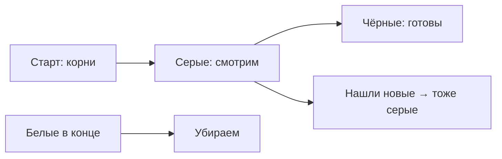

# Garbage Collector (сборщик мусора)

**Одной фразой:** программа создаёт данные в памяти. Когда они больше не нужны, **сборщик мусора (GC)** находит их и освобождает место под новые данные.

## Два места для данных: стек и куча

**Стек** — быстрая память «для текущей работы функции». Закончил функцию — кадр стека пропал сам. GC тут почти не работает.

**Куча (heap)** — общая память программы для данных, которые живут дольше одной функции. Вот её как раз и чистит GC.

Как Go решает, куда положить? Есть **escape analysis** (анализ побега): компилятор смотрит, «убегает» ли значение из функции.

```go
func простоЧисло() int {
    x := 42
    return x // часто останется на стеке
}

func указательНаружу() *int {
    x := 42
    return &x // указатель ушёл наружу → обычно куча
}
```

Грубо: вернул указатель / положил в структуру надолго / отправил в канал → скорее куча → зона GC.

## Как GC понимает, что можно удалить

Он не считает «сколько ссылок» на каждый объект (это другой подход). Он делает так:

1. Берёт **корни** — то, от чего точно нельзя отказаться: глобальные переменные, локальные переменные живых горутин и т.п.
2. Идёт по всем указателям, как по стрелочкам: «на что ещё можно дойти?»
3. Всё, до чего **дойти нельзя** — мусор. Это можно отдать обратно.

Такой подход называют **tracing** (трассировка, обход по ссылкам). Поэтому циклы вроде «A ссылается на B, B на A» не страшны: если от корней до цикла не добраться — оба объекта мусор.

## Три цвета (самая частая картинка на собесе)

Пока GC ищет живое, объекты как будто красят:

| Цвет       | Простыми словами                                     |
| ---------- | ---------------------------------------------------- |
| **Белый**  | ещё не доказали, что нужен (кандидат в мусор)        |
| **Серый**  | нужен, но ещё не посмотрели, на что он сам ссылается |
| **Чёрный** | нужен, и все его ссылки уже проверили                |

Схема:



Сначала от корней появляются серые. Серый разобрали → он чёрный, а то, на что он ссылался, стало серым. Когда серых не осталось — все **белые** можно чистить.

Этот алгоритм называют **mark-and-sweep**:

- **mark** (пометить) — найти всё живое;
- **sweep** (подмести) — убрать непомеченное.

## GC работает «в фоне», но иногда всё же тормозит

Большую часть работы Go старается делать **одновременно** с твоей программой (**concurrent** = параллельно с кодом приложения).

Но иногда нужен короткий **STW — stop-the-world** («остановить мир»): на мгновение все горутины пользователя встают, runtime делает служебную работу, потом всё снова бежит. В современном Go такие паузы обычно **короткие**. Неправильно говорить «в Go нет пауз» — они есть, просто их стараются сделать маленькими.

## Почему нужен write barrier (барьер записи)

Пока GC ищет живое, твоя программа продолжает работать и **переписывать указатели**. Можно случайно «спрятать» объект так, что GC его не заметит.

**Write barrier** — страховка runtime при записи указателей во время сборки: «эй, этот объект тоже учти». На собесе хватает: _барьер нужен, потому что GC ищет мусор одновременно с работой программы_.

## Когда запускается уборка: GOGC и GOMEMLIMIT

Runtime сам выбирает момент. Две главные крутилки:

### GOGC — «как часто относительно роста памяти»

По умолчанию **100**. Смысл грубо такой: «когда куча выросла примерно в **два раза** по сравнению с тем, что осталось живым после прошлой уборки — пора снова».

- больше GOGC (например 200) → уборка **реже**, памяти может быть **больше**, CPU на GC меньше;
- меньше GOGC (например 50) → уборка **чаще**, пик памяти меньше, CPU на GC больше;
- `GOGC=off` → этот режим частоты выключить (осторожно).

```go
import "runtime/debug"

debug.SetGCPercent(100) // то же, что GOGC=100
```

### GOMEMLIMIT — «мягкий потолок памяти»

С Go 1.19 можно сказать: «старайся не раздуваться выше такого лимита». Когда близко к потолку — GC включается **активнее**, даже если GOGC ещё «не просил».

Удобно в Docker/Kubernetes: лимит контейнера 512 МБ → ставишь GOMEMLIMIT чуть меньше, чтобы система не убила процесс раньше, чем GC подчистит.

**Разница простыми словами:**

- **GOGC** — _как часто_ убирать относительно роста кучи;
- **GOMEMLIMIT** — _не выходи за мягкий максимум памяти_.

## Green Tea (новое в свежих версиях Go)

**В чём смысл.** Старый marking часто ходил по объектам «прыжками»: нашёл указатель → прыгнул в другую область памяти → снова прыжок. Для процессора это неудобно: кэш постоянно промахивается, GC тратит много CPU просто на ожидание памяти.

**Green Tea** меняет *порядок обхода* при mark: старается работать кусками памяти **рядом** (страницами / span), а не скакать по всей куче. Локальность лучше → кэш процессора эффективнее → **меньше времени CPU на саму сборку**. На GC-тяжёлых программах часто пишут про экономию порядка **~10%** времени в GC (иногда заметно больше). Это не «программа целиком быстрее на 40%», а «уборщик жрёт меньше процессора».

Важно: **логика та же** (от корней, tri-color, write barrier, mark/sweep). Green Tea — про *как быстро и удобно для железа обходить кучу*, а не про новый смысл «что считать мусором».

**Версии.** В **Go 1.25** — эксперимент (`GOEXPERIMENT=greenteagc`). В **Go 1.26** — **по умолчанию**; отключить можно `GOEXPERIMENT=nogreenteagc`, если очень надо. Тебе как автору кода обычно **ничего менять не нужно**. Подробнее: [блог про Green Tea](https://go.dev/blog/greenteagc).

## Частые мифы

- «GC сразу отдал память операционке» — не всегда. Часто память остаётся у процесса «про запас» под новые аллокации. Поэтому RSS (сколько видит ОС) может не упасть сразу.
- «GC закроет файл/сокет за меня» — нет. Файлы и соединения закрывай сам (`Close`), GC про другое.
- «Если есть цикл ссылок — утечка» — в Go tracing-GC циклы сами по себе не держат мусор, если до них нет пути от корней.

Настоящая «утечка» в Go часто такая: горутина не завершилась; map растёт без очистки; кэш без лимита; забыли прочитать из канала.

## Как смотреть, что происходит

```bash
GODEBUG=gctrace=1 ./app   # пишет в консоль, когда был GC
```

```go
var m runtime.MemStats
runtime.ReadMemStats(&m) // сколько памяти, сколько раз был GC
runtime.GC()             // принудительно запустить цикл (для отладки)
```

Для поиска утечек обычно берут **pprof** (профиль кучи / горутин) — это отдельный навык, но слово полезно знать.

## Короткий ответ на собесе

«В Go есть сборщик мусора: он от корней обходит достижимые объекты (mark), остальное убирает (sweep). Работает в основном вместе с программой, бывают короткие паузы STW. Частоту регулирует GOGC, мягкий потолок памяти — GOMEMLIMIT. На кучу попадает то, что „убежало“ со стека.»

## Готовые формулировки

**Что такое GC?**  
Автоматическая очистка ненужной памяти в куче.

**Mark and sweep?**  
Сначала пометить живое, потом убрать непомеченное.

**Tri-color?**  
Белый / серый / чёрный — стадии „ещё не знаем / смотрим / уже проверили“.

**STW?**  
Короткая полная пауза программы на служебные шаги GC.

**GOGC?**  
Настройка, как часто запускать GC относительно роста кучи (по умолчанию 100).

**GOMEMLIMIT?**  
Мягкий лимит памяти процесса.

**Почему память в диспетчере задач не упала?**  
Процесс часто оставляет память себе на новые объекты; ОС это не всегда сразу забирает.

## Мини-шпаргалка

| Слово         | Простыми словами                            |
| ------------- | ------------------------------------------- |
| GC            | уборщик ненужной памяти                     |
| heap / куча   | долгая общая память программы               |
| stack / стек  | быстрая память текущих вызовов функций      |
| mark          | найти всё ещё нужное                        |
| sweep         | убрать ненужное                             |
| STW           | на мгновение остановить всех                |
| GOGC          | как часто убирать                           |
| GOMEMLIMIT    | мягкий потолок памяти                       |
| write barrier | страховка при записи указателей во время GC |

## Видео и что почитать

- [Getting to Go: The Journey of Go's Garbage Collector — Rick Hudson](https://www.youtube.com/watch?v=aiv1JOfMjuI) (англ.) — как Go пришёл к современному GC; можно на 1.5× и с субтитрами.
- По-русски и по делу про новое: [Green Tea GC в Go 1.26 на Хабре](https://habr.com/ru/articles/1063470/).
- Главный справочник по настройкам: [go.dev/doc/gc-guide](https://go.dev/doc/gc-guide).
