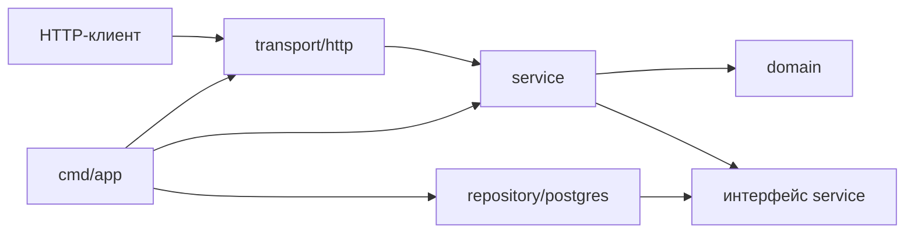

# Организация проекта Go

В Go нет единственной обязательной структуры проекта. Маленькую программу нормально начать с нескольких файлов рядом с `go.mod`, а каталоги добавлять только по мере роста. Главная цель структуры — чтобы было понятно, **где точка входа, где бизнес-логика и куда направлены зависимости**.

## Базовая структура

```text
my-project/
├── cmd/
│   └── app/
│       └── main.go
├── internal/
│   ├── app/
│   ├── service/
│   ├── repository/
│   └── transport/
├── migrations/
├── configs/
├── go.mod
├── go.sum
└── README.md
```

Не каждый проект обязан содержать все эти каталоги.

### `cmd/`

Содержит точки входа в исполняемые приложения. Имя вложенного каталога обычно совпадает с именем собираемого бинарника:

```text
cmd/api/main.go
cmd/worker/main.go
```

В `main.go` оставляют минимум логики: чтение конфигурации, сбор зависимостей, запуск приложения и корректное завершение. Бизнес-правила размещают в отдельных пакетах.

### `internal/`

Код с ограниченной областью импорта. Go разрешает импортировать пакет под `internal` только из дерева, корнем которого является родитель этого `internal`. Это правило инструментария Go, а не условность имени и не буквально граница Git-репозитория.

Внутри можно разделить ответственность по слоям:

- `transport` — HTTP/gRPC-хендлеры, разбор запроса и формирование ответа;
- `service` — бизнес-логика и сценарии приложения;
- `repository` — работа с базой данных или другим хранилищем;
- `app` — сборка зависимостей и запуск приложения.

Типичное направление вызовов:

```text
transport → service → repository
```

Хендлер не должен обращаться к базе напрямую, а репозиторий не должен зависеть от HTTP-слоя. Это уменьшает связанность и упрощает тестирование.

## Слои backend-сервиса на примере плейлиста

Для учебного playlist-сервиса используется следующая структура:

```text
cmd/app/
└── main.go

internal/
├── domain/
├── service/
├── repository/
│   └── postgres/
└── transport/
    └── http/

migrations/
```

Это не обязательный стандарт Go, а выбранный способ разделить ответственности. Название каталога само по себе ничего не гарантирует: важно, какой код в нём находится и куда направлены зависимости.

### `cmd/app` — сборка и запуск

`main.go` является **composition root** — местом, где создаются и связываются конкретные реализации:

```text
PostgreSQL repository → service → HTTP handler → HTTP server
```

Здесь читают конфигурацию, открывают соединение с БД, создают зависимости, запускают сервер и обрабатывают корректное завершение. Бизнес-правила в `main.go` не размещают.

### `internal/domain` — предметная область

Домен описывает смысл данных и правила, которые существуют независимо от способа доставки и хранения:

- `Song` и `Playlist`;
- допустимая длительность песни;
- состояния и ошибки предметной области;
- операции над плейлистом, не зависящие от HTTP и SQL.

Домен не должен знать о JSON, HTTP-кодах, SQL-драйвере и таблицах PostgreSQL. Поля вроде `context.CancelFunc`, HTTP request или `sql.DB` в доменной сущности обычно означают смешение ответственностей.

### `internal/service` — сценарии использования

Сервис координирует действия приложения:

- создать или изменить песню;
- добавить песню в плейлист;
- удалить песню, только если она сейчас не воспроизводится;
- запустить, приостановить или переключить воспроизведение.

Он использует доменные сущности, проверяет правила сценария и вызывает необходимые зависимости через небольшие интерфейсы.

### `internal/repository/postgres` — хранение

Репозиторий реализует операции с PostgreSQL:

- выполняет SQL-запросы;
- преобразует строки таблиц в доменные сущности;
- управляет транзакциями там, где несколько изменений должны выполниться атомарно;
- переводит технические ошибки БД в ошибки, понятные сервису.

Репозиторий не формирует HTTP-ответы и не решает, можно ли удалить воспроизводимую песню: это бизнес-правило сервиса.

### `internal/transport/http` — граница HTTP

HTTP-слой:

- читает path/query-параметры и JSON;
- проверяет корректность формата входных данных;
- вызывает один метод сервиса;
- преобразует результат и ошибки в JSON и HTTP-коды.

Хендлер не должен самостоятельно выполнять SQL или управлять двусвязным списком.

### `migrations` — версия схемы БД

Миграции содержат последовательные изменения структуры базы. Они нужны, чтобы разработчики, тестовые окружения и production получали одинаковые таблицы, индексы и ограничения.

## Направление зависимостей

Вызов проходит от внешнего слоя к внутреннему:



Схема показывает обращение к контрактам и сборку. В Go реализация удовлетворяет интерфейсу неявно, поэтому postgres-пакет не обязан импортировать service ради объявления реализации. `domain` не импортирует остальные слои, а `cmd/app` собирает конкретные компоненты.

## Интерфейс объявляет потребитель

Если сервису требуется сохранить песню, именно сервис описывает минимальный контракт, который ему нужен:

```go
// package service
type SongRepository interface {
	Create(ctx context.Context, song domain.Song) (domain.Song, error)
}
```

Пакет `repository/postgres` реализует этот контракт. Сервис при этом не импортирует PostgreSQL-драйвер и в unit-тесте может получить простую подмену репозитория.

Это и есть инверсия зависимости:

```text
service → свой интерфейс ← postgres.Repository
```

Интерфейсы создают не для каждой структуры заранее, а на границе с внешней зависимостью и только из методов, реально нужных потребителю.

## Как проходит запрос

Пример `POST /playlists/10/songs`:

```text
HTTP handler
    → разбирает playlist_id, song_id и JSON
service
    → проверяет сценарий добавления
repository
    → записывает playlist_songs в PostgreSQL
domain
    → остаётся независимым от HTTP и PostgreSQL
```

Такое разделение позволяет отдельно тестировать HTTP-преобразования, бизнес-сценарии и SQL.

### `pkg/`

Используется для пакетов, которые действительно предназначены для импорта другими проектами. Каталог необязателен: общий код внутри одного приложения обычно лучше оставить в `internal`.

Не стоит переносить код в `pkg` только потому, что он используется в нескольких местах текущего проекта.

## Служебные каталоги

- `configs/` — примеры или статические файлы конфигурации;
- `migrations/` — миграции базы данных;
- `api/` — OpenAPI, protobuf и другие описания API;
- `docs/` — архитектурная и проектная документация;
- `scripts/` — вспомогательные сценарии сборки, генерации и проверок;
- `deployments/` — Docker Compose, Kubernetes, Helm и другие файлы развёртывания;
- `testdata/` — тестовые данные; Go игнорирует этот каталог при поиске пакетов.

Добавлять их следует только тогда, когда в проекте появились соответствующие файлы.

## Как выбирать пакеты

Пакет должен объединять код одной предметной области или ответственности. Хорошие имена описывают назначение: `order`, `payment`, `repository`, `http`. Имена вроде `utils`, `common` и `helpers` часто скрывают несвязанный код и со временем превращаются в свалку.

Практические правила:

- начинать с простой структуры и усложнять её по необходимости;
- не создавать пакет ради одного файла без ясной границы ответственности;
- избегать циклических зависимостей;
- держать интерфейс рядом с кодом, который его использует;
- не смешивать транспорт, бизнес-логику и работу с хранилищем;
- проверять, что название пакета понятно в месте использования: `order.Service`, а не `services.OrderService` без необходимости.

## Модули и зависимости

`go.mod` задаёт путь модуля, версию языка и зависимости. `go.sum` хранит контрольные суммы загруженных модулей; это не аналог lock-файла со всем выбранным графом. `go mod tidy` приводит зависимости в соответствие импортам, `go mod verify` проверяет кеш модулей. `go work` объединяет локальные модули для разработки. Циклические импорты запрещены; общий контракт выносят к потребителю или в нижний пакет.

## Что важно запомнить

`cmd` — точки входа, `internal` — закрытая логика приложения, `pkg` — только реально переиспользуемая внешняя библиотека. Структура должна помогать ориентироваться в коде, а не копировать большой шаблон заранее.

## Источники

- [The Go Programming Language: Organizing a Go module](https://go.dev/doc/modules/layout)
- [Alistair Cockburn: Hexagonal Architecture](https://alistair.cockburn.us/hexagonal-architecture/)
- [Ardan Labs: Package-Oriented Design](https://www.ardanlabs.com/blog/2017/02/package-oriented-design.html)
- [Как структурировать проект на Golang: гайд от backend-разработчика](https://habr.com/ru/companies/inDrive/articles/690088/)

## Видео для закрепления

- [Архитектура Go-проекта на практике](https://www.youtube.com/watch?v=hDwqFRUuykQ) — рус., пример слоёв и Clean Architecture в Go.
- [GopherCon 2017: Design Philosophy On Packaging](https://www.youtube.com/watch?v=spKM5CyBwJA) — англ., принципы проектирования пакетов и зависимостей.
