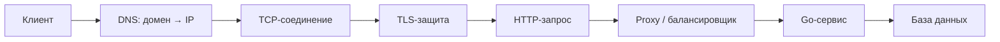
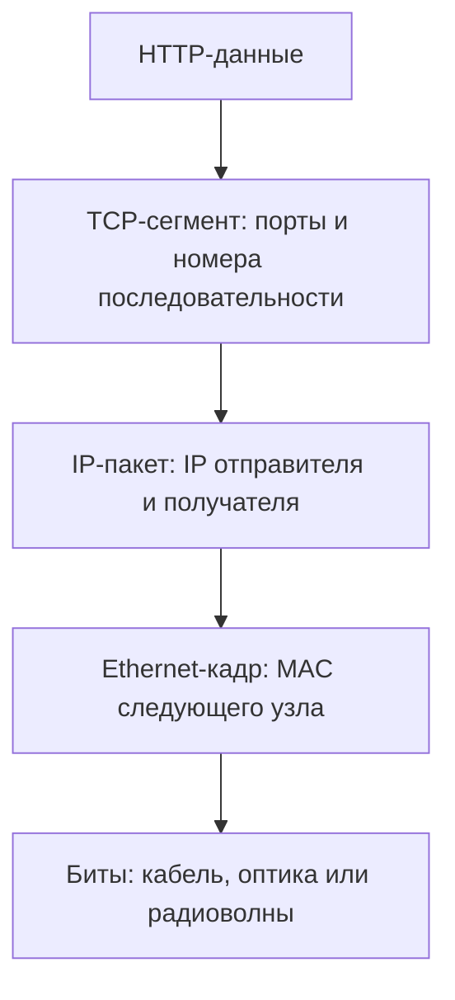
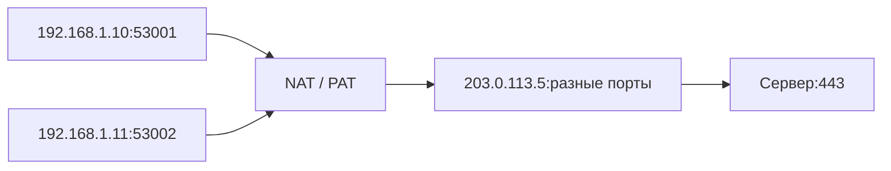
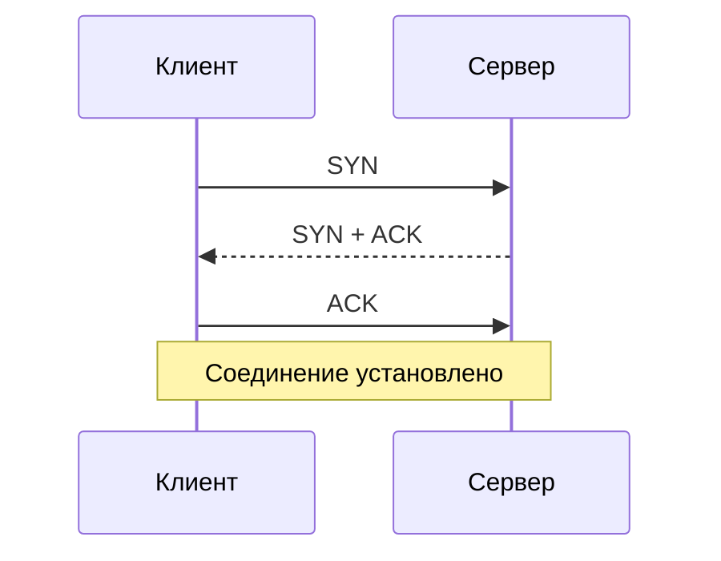
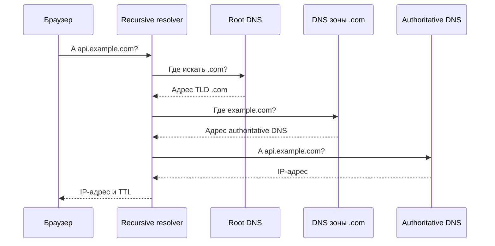
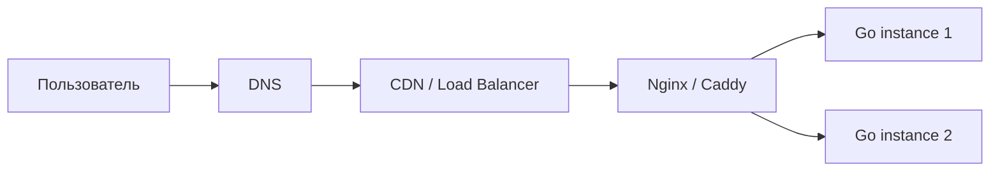
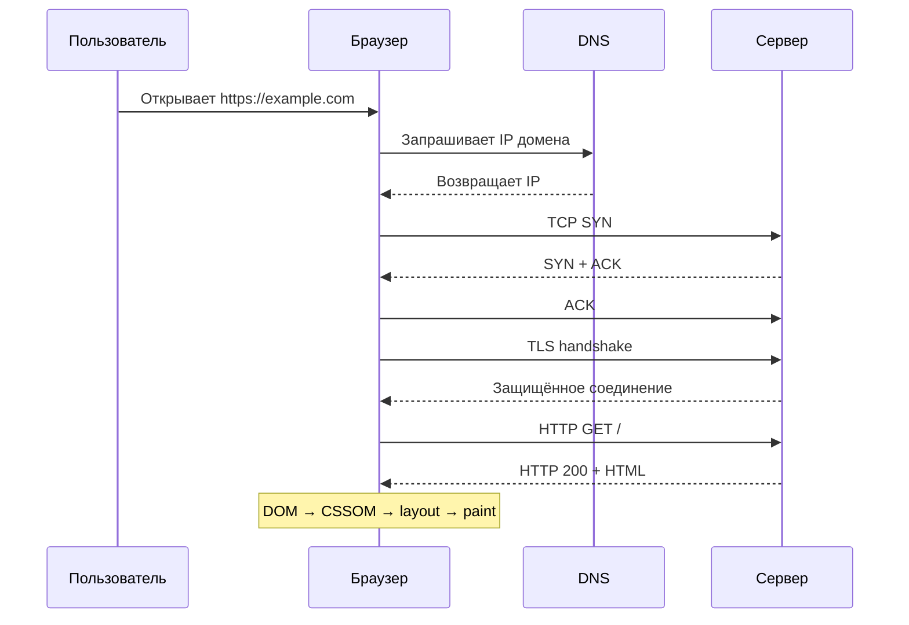

# Компьютерные сети

Компьютерная сеть — группа устройств, которые обмениваются данными по общим правилам — **протоколам**. Интернет — глобальная **сеть сетей**, а World Wide Web — только одно из приложений интернета наряду с электронной почтой, SSH и другими.

Для backend-разработчика сети — это не абстракция: HTTP-сервис, база данных, DNS, балансировщик и внешний API общаются через сетевой стек. Понимание его уровней помогает находить причины таймаутов, недоступных портов и медленных запросов.

## Главная картина

При обращении к `https://api.example.com/users` происходит примерно следующее:



Короткая формула:

```text
DNS находит адрес
IP доставляет пакеты между сетями
TCP обеспечивает надёжный поток
TLS защищает соединение
HTTP задаёт смысл запроса и ответа
```

## Модели OSI и TCP/IP

OSI — теоретическая семиуровневая модель, удобная для классификации протоколов и поиска неисправностей. Реальный интернет обычно описывают четырьмя уровнями TCP/IP.

| OSI | TCP/IP | Назначение | Примеры |
|---|---|---|---|
| 7–5. Прикладной, представления, сеансовый | Прикладной | Взаимодействие приложений | HTTP, DNS, TLS, SMTP |
| 4. Транспортный | Транспортный | Доставка между процессами | TCP, UDP, порты |
| 3. Сетевой | Межсетевой | Доставка между сетями | IPv4, IPv6, ICMP, маршрутизаторы |
| 2–1. Канальный и физический | Доступ к сети | Передача на текущем участке | Ethernet, Wi-Fi, MAC, кабель, радио |

Практическая польза слоёв: если домен не разрешается — смотри DNS; IP доступен, но порт закрыт — транспортный уровень или приложение; локальная сеть не работает — интерфейс, Wi-Fi, Ethernet, ARP.

## Инкапсуляция

Каждый уровень добавляет к данным свой заголовок. На принимающей стороне заголовки снимаются в обратном порядке — это декапсуляция.



Названия единиц данных:

- прикладной уровень — данные или сообщение;
- TCP — сегмент, UDP — датаграмма;
- IP — пакет;
- Ethernet — кадр;
- физический уровень — биты или сигнал.

## Канальный уровень: Ethernet, MAC и ARP

Канальный уровень передаёт кадр в пределах одного сетевого сегмента.

**MAC-адрес** идентифицирует сетевой интерфейс на канальном уровне. Например: `a1:b2:c3:d4:e5:f6`. MAC используется локально и меняется в заголовке кадра при переходе к следующему сетевому участку. Он не обязан быть неизменным или глобально уникальным: адрес можно назначить программно.

**Коммутатор (switch)** соединяет устройства локальной сети. Он запоминает, за каким портом находится MAC-адрес, и направляет кадр на нужный порт. Маршрутизатор, в отличие от коммутатора, соединяет разные IP-сети.

**ARP** в IPv4 узнаёт MAC по локальному IP. Например, компьютер знает IP шлюза `192.168.1.1`, отправляет широковещательный ARP-запрос и получает MAC интерфейса маршрутизатора. В IPv6 похожую задачу решает Neighbor Discovery.

## IP и маршрутизация

IP отвечает за адресацию и доставку пакетов между сетями. Он работает по принципу best effort: пакет может потеряться, задержаться, продублироваться или прийти не по порядку.

IPv4 состоит из 32 бит:

```text
192.168.1.15
```

IPv6 состоит из 128 бит:

```text
2001:db8::15
```

### Подсети и CIDR

Запись `192.168.1.15/24` означает, что первые 24 бита описывают сеть, остальные — адрес внутри неё.

```text
Адрес:     192.168.1.15
Префикс:   /24
Сеть:      192.168.1.0
Диапазон:  192.168.1.0–192.168.1.255
```

Устройство сравнивает адрес назначения со своей подсетью:

- адрес в той же подсети — отправляет напрямую;
- адрес в другой сети — отправляет **шлюзу по умолчанию**.

### Частные и специальные IPv4-адреса

Частные диапазоны не маршрутизируются в публичном интернете:

```text
10.0.0.0/8
172.16.0.0/12
192.168.0.0/16
```

Полезно помнить:

- `127.0.0.1` — loopback, текущая машина;
- `0.0.0.0` при запуске сервера — слушать все локальные IPv4-интерфейсы;
- `localhost` — имя, обычно разрешаемое в loopback-адрес;
- публичный IP доступен для глобальной маршрутизации, если это разрешают firewall и инфраструктура.

### Маршрутизатор

Маршрутизатор читает IP назначения, сверяется с таблицей маршрутизации и выбирает следующий узел — **next hop**. Пакет проходит через несколько маршрутизаторов, пока не попадёт в сеть назначения.

На каждом переходе:

- IP назначения обычно остаётся прежним;
- MAC-адреса кадра меняются;
- TTL уменьшается, защищая от бесконечных циклов маршрутизации.

### NAT

NAT (Network Address Translation) изменяет адреса в пакетах. Домашние маршрутизаторы обычно используют PAT/NAPT: несколько частных соединений разделяют один публичный IPv4 за счёт преобразования пары `IP:порт`.



NAT помогает экономить IPv4-адреса, но это не firewall и не механизм шифрования.

### ICMP

ICMP передаёт служебные и диагностические сообщения IP-сети. `ping` обычно использует ICMP Echo Request/Reply. Отсутствие ответа не всегда означает, что сервер выключен: ICMP может блокироваться.

## Порты, сокеты и соединения

IP направляет пакет на устройство, а **порт** помогает операционной системе передать данные нужному процессу.

Порты имеют значения от `0` до `65535`:

| Порт | Служба |
|---:|---|
| 22 | SSH |
| 53 | DNS |
| 80 | HTTP |
| 443 | HTTPS |
| 5432 | PostgreSQL |
| 6379 | Redis |

Диапазон `0–1023` исторически относится к well-known ports. Клиент обычно использует временный **ephemeral port**.

Сокет — программная конечная точка связи. TCP-соединение однозначно задаётся четырьмя значениями:

```text
IP клиента + порт клиента + IP сервера + порт сервера
```

Поэтому сервер способен обслуживать множество клиентов на одном порту `443`.

## TCP

TCP предоставляет над IP надёжный двунаправленный **поток байтов**.

Перед передачей данных выполняется three-way handshake:



TCP обеспечивает:

- доставку без пропусков для приложения или ошибку соединения;
- правильный порядок байтов;
- обнаружение потерь и повторную передачу;
- удаление дубликатов;
- flow control, чтобы не переполнить получателя;
- congestion control, чтобы не перегрузить сеть.

TCP не сохраняет границы сообщений. Две записи `hello` и `world` могут читаться как один фрагмент `helloworld` или несколькими частями. Прикладной протокол сам задаёт framing: длину сообщения, разделитель или другой формат.

TCP применяется в HTTP/1.1, HTTP/2, PostgreSQL, Redis и SSH.

## UDP

UDP передаёт отдельные датаграммы без установки соединения на уровне самого UDP.

Он не гарантирует:

- доставку;
- порядок;
- отсутствие дубликатов;
- автоматическую повторную передачу.

Это уменьшает накладные расходы. UDP используют DNS, голосовая и видеосвязь, игры и телеметрия. QUIC работает поверх UDP, но самостоятельно реализует соединение, надёжность, шифрование и потоки; поверх QUIC работает HTTP/3.

| TCP | UDP |
|---|---|
| Поток байтов | Отдельные датаграммы |
| Есть handshake | У UDP handshake нет |
| Гарантирует порядок | Порядок не гарантирует |
| Повторяет потерянные данные | Не повторяет автоматически |
| Flow и congestion control | При необходимости реализуются выше |

UDP не «всегда быстрее». Итог зависит от прикладного протокола, сети и требований к надёжности.

## Домен, URL и DNS

Домен — удобное человеку имя ресурса:

```text
api.example.com
```

Здесь `com` — домен верхнего уровня (TLD), `example` — домен второго уровня, `api` — поддомен.

Домен — только часть URL:

```text
https://api.example.com:443/users?id=42#profile
└─scheme─┘ └────host────┘ port └path┘ query fragment
```

DNS — распределённая иерархическая система, которая хранит записи о доменах. Самая частая задача — получить IP по имени.



Сначала проверяются кэши браузера, ОС и resolver. Если ответа нет, resolver проходит иерархию. **TTL** определяет, сколько времени запись можно кэшировать.

Основные записи:

| Тип | Назначение |
|---|---|
| `A` | Имя → IPv4 |
| `AAAA` | Имя → IPv6 |
| `CNAME` | Псевдоним другого имени |
| `MX` | Почтовые серверы домена |
| `NS` | Авторитетные DNS-серверы |
| `TXT` | Текстовые данные, часто проверки и политики |

DNS обычно использует UDP/53, но может использовать TCP, например при больших ответах и передаче зон. DNS находит адрес, но не устанавливает HTTP-соединение.

## DHCP

DHCP автоматически выдаёт устройству сетевые настройки:

- IP-адрес и срок аренды;
- маску или префикс подсети;
- шлюз по умолчанию;
- адреса DNS-серверов.

Классическая последовательность DHCPv4 называется DORA: Discover, Offer, Request, Acknowledge.

## HTTP

HTTP — прикладной протокол с моделью request-response. Клиент отправляет запрос, сервер возвращает ответ.

```http
GET /users/42 HTTP/1.1
Host: api.example.com
Accept: application/json
```

```http
HTTP/1.1 200 OK
Content-Type: application/json
Content-Length: 23

{"id":42,"name":"Ann"}
```

Запрос содержит метод, target/URL, версию, заголовки и необязательное тело. Ответ — версию, статус, заголовки и необязательное тело.

### Методы

| Метод | Типичный смысл | Идемпотентен |
|---|---|---|
| `GET` | Получить ресурс | Да |
| `POST` | Создать ресурс или выполнить команду | Обычно нет |
| `PUT` | Полностью заменить ресурс | Да |
| `PATCH` | Частично изменить ресурс | Не гарантируется |
| `DELETE` | Удалить ресурс | Да по ожидаемому эффекту |

Идемпотентность означает, что повтор одного запроса имеет тот же ожидаемый эффект на состояние сервера, что и один вызов. Это не означает одинаковый HTTP-ответ или отсутствие побочных технических событий вроде логирования.

### Статусы

| Группа | Смысл | Примеры |
|---:|---|---|
| `1xx` | Информация | `100 Continue` |
| `2xx` | Успех | `200 OK`, `201 Created`, `204 No Content` |
| `3xx` | Перенаправление и кэш | `301`, `302`, `304` |
| `4xx` | Ошибка запроса клиента | `400`, `401`, `403`, `404`, `429` |
| `5xx` | Ошибка на стороне сервера | `500`, `502`, `503`, `504` |

HTTP — stateless: каждый запрос должен содержать достаточно информации для обработки. Сессии строятся поверх HTTP с помощью cookie, токенов и серверного состояния.

### Версии HTTP

- **HTTP/1.1** — persistent connections и последовательные сообщения в соединении; несколько соединений часто используются параллельно.
- **HTTP/2** — бинарный framing и мультиплексирование нескольких потоков внутри одного TCP-соединения.
- **HTTP/3** — работает поверх QUIC/UDP; потеря пакета в одном потоке не должна останавливать доставку независимых потоков на транспортном уровне.

## HTTPS и TLS

HTTPS — HTTP через TLS. TLS обеспечивает:

- конфиденциальность — содержимое шифруется;
- целостность — изменение данных обнаруживается;
- аутентификацию сервера с помощью сертификата.

Во время TLS-handshake стороны согласуют параметры защиты, сервер показывает сертификат, а стороны получают ключи сеанса. Браузер проверяет домен, срок действия сертификата и цепочку до доверенного центра сертификации.

HTTPS не делает приложение автоматически безопасным: он защищает данные **в пути**, но не исправляет SQL injection, слабую авторизацию или утечку данных на сервере.

## Hosting и веб-сервер

Hosting — инфраструктура, на которой приложение доступно по сети: вычислительные ресурсы, память, диск, сетевой адрес и средства эксплуатации.

Распространённые варианты:

- shared hosting — несколько сайтов делят один сервер;
- VPS/VM — изолированная виртуальная машина;
- dedicated server — отдельный физический сервер;
- cloud — ресурсы предоставляются как сервис и масштабируются;
- containers/serverless — приложение запускается в управляемой среде.

**Web server** может означать машину или программу, принимающую HTTP-запросы. Nginx или Caddy часто завершают TLS, отдают статические файлы, проксируют запросы в Go-сервис и балансируют нагрузку.



## Что делает браузер

Упрощённый путь загрузки страницы:

1. Разбирает URL.
2. Проверяет кэши и разрешает домен через DNS.
3. Устанавливает TCP или QUIC-соединение.
4. Для HTTPS выполняет TLS-handshake.
5. Отправляет HTTP-запрос и получает HTML.
6. Разбирает HTML в DOM и загружает CSS, JavaScript, изображения и шрифты.
7. Строит CSSOM и render tree, рассчитывает layout и рисует страницу.
8. Выполняет JavaScript и обрабатывает действия пользователя.

Для backend-разработчика важна первая половина: каждый новый hostname может потребовать DNS lookup и соединение, а большое число последовательных запросов увеличивает задержку.

## Жизнь одного запроса

Правильная последовательность для первого HTTPS-запроса по HTTP/1.1 или HTTP/2:



В локальной сети перед отправкой кадра может потребоваться ARP/Neighbor Discovery. На домашнем маршрутизаторе может применяться NAT. В интернете пакет проходит несколько маршрутизаторов. Ответ не обязан идти через абсолютно те же узлы.

## Сетевые таймауты и ошибки

Сетевая операция не должна ждать бесконечно. В production важны отдельные ограничения на:

- DNS и установку соединения;
- TLS-handshake;
- ожидание заголовков ответа;
- чтение и запись;
- полное время бизнес-операции.

В Go отмену запроса передают через `context.Context`:

```go
ctx, cancel := context.WithTimeout(parent, 2*time.Second)
defer cancel()

req, err := http.NewRequestWithContext(ctx, http.MethodGet, url, nil)
```

`http.Client` следует переиспользовать: вместе с `Transport` он управляет пулом соединений. Создание нового клиента на каждый запрос мешает переиспользованию соединений. Тело ответа необходимо закрывать.

Сервер также должен иметь разумные `ReadHeaderTimeout`, `ReadTimeout`, `WriteTimeout` и `IdleTimeout`, выбранные под характер трафика.

## Диагностика

Двигайся снизу вверх и отделяй разные виды доступности.

| Инструмент | Что проверяет |
|---|---|
| `ip addr`, `ifconfig` | Интерфейсы и локальные адреса |
| `ip route`, `route` | Таблицу маршрутизации и шлюз |
| `arp`, `ip neigh` | ARP/neighbor cache |
| `dig`, `nslookup` | DNS-записи и resolver |
| `ping` | ICMP-доступность и задержку, если ICMP разрешён |
| `traceroute`, `tracert` | Промежуточные участки маршрута |
| `nc -vz host port` | Возможность установить TCP-соединение с портом |
| `curl -v` | DNS, соединение, TLS и HTTP-обмен |
| `ss`, `netstat`, `lsof -i` | Какие сокеты слушаются локально |
| Wireshark, `tcpdump` | Реальные пакеты и заголовки |

Пример логики поиска:

```text
Нет IP-связи          → интерфейс, маршрут, gateway, firewall
IP работает, имя нет  → DNS
Имя и IP работают,
но порт недоступен    → listener, firewall, service
Порт доступен,
HTTP отвечает плохо   → proxy, TLS, приложение, dependency
```

## Что важно на собеседовании

### Чем IP отличается от MAC?

IP используется для маршрутизации между сетями. MAC используется для доставки кадра на текущем канальном участке. При прохождении маршрутизатора кадр создаётся заново с другими MAC-адресами.

### Чем TCP отличается от UDP?

TCP — упорядоченный надёжный поток с соединением, повторной передачей и контролем перегрузки. UDP — независимые датаграммы без этих гарантий. Выбор зависит от требований протокола, а не только от скорости.

### Что происходит после ввода URL?

Разбор URL → DNS → выбор маршрута → TCP или QUIC → TLS для HTTPS → HTTP-запрос → ответ → загрузка ресурсов → построение и отрисовка страницы.

### Зачем нужны порты?

Чтобы операционная система могла направить входящие данные конкретному процессу. IP определяет сетевой узел, порт — приложение на нём.

### Что делает DNS?

DNS хранит и разрешает записи доменных имён. Recursive resolver использует кэш либо обращается к root, TLD и authoritative DNS, после чего возвращает запись клиенту.

### Что гарантирует TCP?

Приложение получает упорядоченный поток байтов без пропусков либо узнаёт об ошибке соединения. TCP не гарантирует сохранение границ сообщений и не гарантирует минимальную задержку.

### Почему `ping` работает, а HTTP нет?

`ping` проверяет ICMP, а HTTP требует доступного TCP/QUIC-порта, работающего сервера, корректного TLS и прикладного ответа. Успех одного уровня не доказывает успех остальных.

### Чем `502`, `503` и `504` отличаются концептуально?

- `502 Bad Gateway` — proxy получил некорректный ответ от upstream;
- `503 Service Unavailable` — сервис временно не готов обслужить запрос;
- `504 Gateway Timeout` — proxy не дождался upstream вовремя.

## Что важно запомнить

- Интернет — сеть сетей; Web — приложение поверх интернета.
- Уровни разделяют ответственность и помогают диагностировать проблему.
- MAC доставляет кадр локально, IP маршрутизирует пакет между сетями.
- Порт определяет процесс, сокет — конечную точку связи.
- TCP даёт надёжный поток, UDP — датаграммы без встроенных гарантий.
- DNS преобразует имена в записи, включая IP-адреса.
- HTTP работает по модели request-response, HTTPS защищает его через TLS.
- Первый запрос обычно включает DNS, соединение, TLS и только затем HTTP.
- Таймауты, переиспользование соединений и корректная отмена обязательны для backend-сервисов.

## Источники

Основная карта тем:

- [Backend Developer Roadmap](https://roadmap.sh/backend) — вкладки Internet, HTTP, Domain Name, Hosting, DNS и Browsers.
- [Сети: база для начинающих](https://habr.com/ru/articles/1036044/) — уровни, инкапсуляция, MAC, IP, TCP/UDP, DNS, DHCP, NAT и диагностика.

Материалы из вкладок roadmap.sh:

- Internet: [How does the Internet Work?](https://cs.fyi/guide/how-does-internet-work), [The Internet Explained](https://www.vox.com/2014/6/16/18076282/the-internet).
- HTTP: [What is HTTP?](https://www.cloudflare.com/learning/ddos/glossary/hypertext-transfer-protocol-http/), [HTTP/3 From A To Z](https://www.smashingmagazine.com/2021/08/http3-core-concepts-part1/).
- Domain Name: [MDN — What is a domain name?](https://developer.mozilla.org/en-US/docs/Learn/Common_questions/Web_mechanics/What_is_a_domain_name), [Cloudflare — Domain name vs. URL](https://www.cloudflare.com/learning/dns/glossary/what-is-a-domain-name/).
- Hosting: [MDN — Pages, sites, servers and search engines](https://developer.mozilla.org/en-US/docs/Learn/Common_questions/Web_mechanics/Pages_sites_servers_and_search_engines), [MDN — What is a web server?](https://developer.mozilla.org/en-US/docs/Learn/Common_questions/Web_mechanics/What_is_a_web_server).
- DNS: [Everything You Need to Know About DNS](https://cs.fyi/guide/everything-you-need-to-know-about-dns), [Cloudflare — What is DNS?](https://www.cloudflare.com/learning/dns/what-is-dns/), [How DNS Works](https://howdns.works/).
- Browsers: [How Browsers Work](https://www.ramotion.com/blog/what-is-web-browser/), [MDN — How browsers work](https://developer.mozilla.org/en-US/docs/Web/Performance/Guides/How_browsers_work).

## Видео для закрепления

- [Основы организации компьютерных сетей — Андрей Созыкин](https://www.youtube.com/watch?v=EPvxn9KvBvs) — **рус.**, уровни, протоколы, стек и инкапсуляция.
- [How does the Internet work? — Full Course](https://www.youtube.com/watch?v=zN8YNNHcaZc) — **англ.**, полный путь данных через основные интернет-протоколы.
