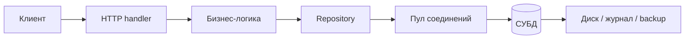
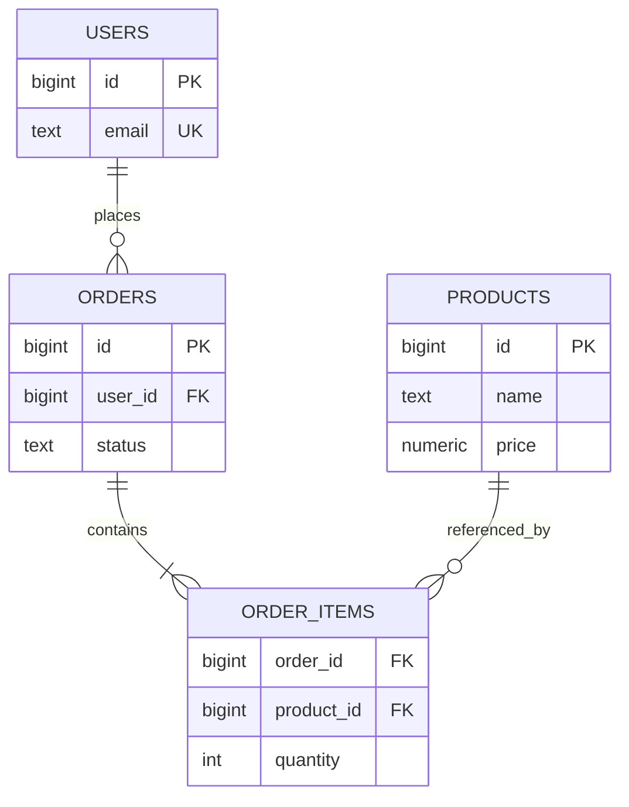
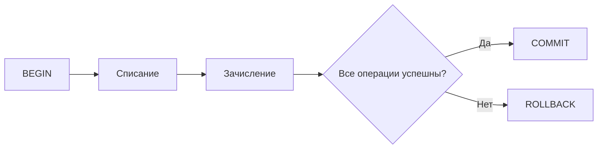
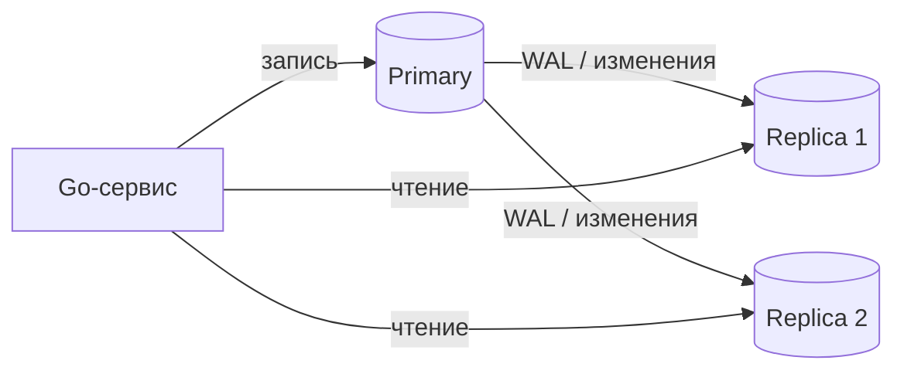
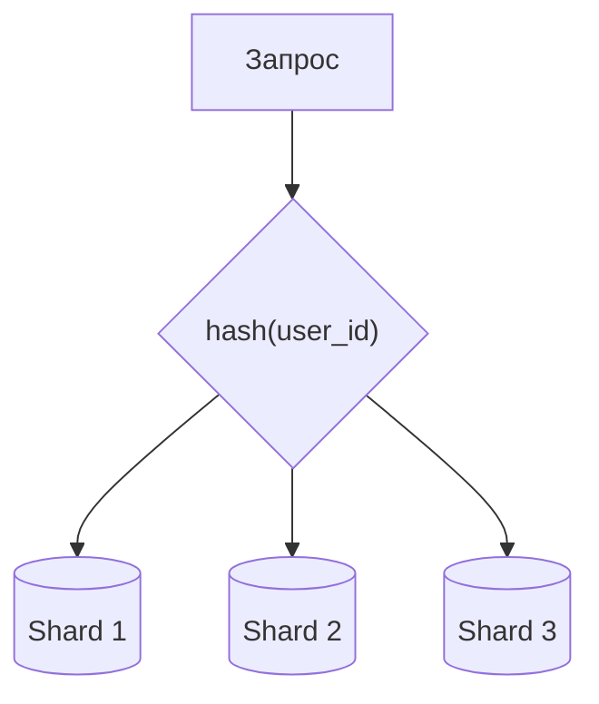

# Базы данных

**База данных (БД)** — организованное долговременное хранилище данных. **Система управления базами данных (СУБД)** — программа, которая хранит эти данные, выполняет запросы, контролирует конкурентный доступ, целостность, безопасность и восстановление после сбоев.

Для backend-разработчика недостаточно уметь написать `SELECT`. На собеседовании обычно проверяют:

- реляционную модель, ключи, связи и нормализацию;
- SQL, `JOIN`, индексы и планы запросов;
- транзакции, ACID, уровни изоляции, MVCC и блокировки;
- репликацию, шардинг, CAP и виды NoSQL;
- безопасную и эффективную работу с БД из Go.

## Главная картина



Приложение формирует запрос, драйвер передаёт его СУБД, а СУБД:

1. разбирает и проверяет SQL;
2. строит план выполнения;
3. читает таблицы или индексы;
4. применяет правила транзакции и блокировки;
5. возвращает результат либо ошибку.

## Реляционные и нереляционные БД

### Реляционная модель

В реляционной БД данные представлены таблицами:

- **строка** — один объект;
- **столбец** — его атрибут с определённым типом;
- **схема** — структура таблиц, связей и ограничений;
- **первичный ключ (`PRIMARY KEY`)** — уникально определяет строку;
- **внешний ключ (`FOREIGN KEY`)** — ссылается на строку другой таблицы;
- **ограничение (`constraint`)** — правило, которое проверяет сама СУБД.



Типичные связи:

| Связь | Реализация |
|---|---|
| Один к одному | внешний ключ с `UNIQUE` |
| Один ко многим | внешний ключ на стороне «многие» |
| Многие ко многим | промежуточная таблица с двумя внешними ключами |

Ограничения `NOT NULL`, `UNIQUE`, `CHECK` и `FOREIGN KEY` защищают данные независимо от ошибок приложения. Проверки только в Go не заменяют ограничения БД: параллельный запрос или другой сервис может обойти их.

### Популярные реляционные СУБД

| СУБД | Где встречается |
|---|---|
| PostgreSQL | универсальная open-source СУБД; хороший основной выбор для backend на Go |
| MySQL / MariaDB | веб-приложения, большое количество готовой инфраструктуры |
| SQLite | встраиваемые и локальные приложения, тесты, небольшие сервисы |
| MS SQL Server | экосистема Microsoft и корпоративные системы |
| Oracle Database | крупные корпоративные системы |

Для обучения не нужно знать все продукты. Важнее уверенно владеть одной СУБД — обычно PostgreSQL — и понимать общие принципы.

### NoSQL

**NoSQL** — группа нереляционных моделей. Это не «замена SQL», а другой набор компромиссов под конкретный доступ к данным.

| Модель | Представление | Подходит для | Примеры из Backend Roadmap |
|---|---|---|---|
| Key-value | `ключ → значение` | кэш, сессии, счётчики | Redis, Memcached, DynamoDB |
| Document | JSON-подобные документы | гибкая структура, документы и каталоги | MongoDB, CouchDB, Firebase, RethinkDB |
| Wide-column | строки с большими наборами колонок | большой поток записей, распределённые данные | Cassandra, ScyllaDB |
| Graph | вершины и рёбра | сложные связи и поиск путей | Neo4j, Dgraph, AWS Neptune |
| Time series | значения с временной меткой | метрики, телеметрия, события | InfluxDB, TimescaleDB |
| Columnar OLAP | данные организованы для аналитики по колонкам | агрегации над большими объёмами | ClickHouse |
| Search engine | инвертированный индекс | полнотекстовый поиск | Elasticsearch, Solr |

Границы условны: Redis поддерживает структуры данных, TimescaleDB построен поверх PostgreSQL, а поисковый движок не стоит делать единственным источником критичных бизнес-данных.

**Практическое правило:** начинай с PostgreSQL, если требования не доказывают необходимость другой модели. Polyglot persistence — использование нескольких хранилищ — оправдано, когда каждое решает понятную задачу, а команда готова платить за дополнительную эксплуатационную сложность.

## SQL: обязательный базис

SQL декларативен: разработчик описывает **какой** результат нужен, а оптимизатор решает **как** его получить.

| Группа | Назначение | Команды |
|---|---|---|
| DDL | изменение схемы | `CREATE`, `ALTER`, `DROP` |
| DML | изменение данных | `INSERT`, `UPDATE`, `DELETE` |
| DQL | чтение данных | `SELECT` |
| TCL | управление транзакциями | `BEGIN`, `COMMIT`, `ROLLBACK` |

Пример запроса:

```sql
SELECT u.id, u.email, COUNT(o.id) AS paid_orders
FROM users AS u
JOIN orders AS o ON o.user_id = u.id
WHERE o.status = 'paid'
  AND o.created_at >= $1
GROUP BY u.id, u.email
HAVING COUNT(o.id) >= 3
ORDER BY paid_orders DESC
LIMIT 100;
```

Логический порядок обработки полезно представлять так:

```text
FROM / JOIN → WHERE → GROUP BY → HAVING → SELECT → ORDER BY → LIMIT
```

Основные `JOIN`:

| Вид | Результат |
|---|---|
| `INNER JOIN` | только совпавшие строки обеих сторон |
| `LEFT JOIN` | все строки слева и совпадения справа; иначе справа `NULL` |
| `RIGHT JOIN` | симметричный вариант относительно `LEFT JOIN` |
| `FULL JOIN` | все строки обеих сторон |
| `CROSS JOIN` | декартово произведение |

Нужно также уметь использовать агрегаты (`COUNT`, `SUM`, `AVG`), подзапросы, `EXISTS`, общие табличные выражения (`WITH`) и оконные функции хотя бы на базовом уровне.

### `NULL`

`NULL` означает отсутствие известного значения. Это не `0` и не пустая строка.

```sql
-- неправильно
WHERE deleted_at = NULL

-- правильно
WHERE deleted_at IS NULL
```

Сравнение с `NULL` обычно даёт `UNKNOWN`, поэтому SQL использует трёхзначную логику: `TRUE`, `FALSE`, `UNKNOWN`. Для подстановки значения применяется `COALESCE`.

## Проектирование схемы и нормализация

**Нормализация** уменьшает дублирование и аномалии изменения данных.

| Форма | Упрощённый смысл |
|---|---|
| 1NF | в ячейке одно атомарное значение, нет повторяющихся групп |
| 2NF | 1NF + неключевые поля зависят от всего составного ключа |
| 3NF | 2NF + неключевые поля не зависят друг от друга транзитивно |

Пример плохой структуры:

```text
orders(id, user_id, user_email, product_ids="4,8,15")
```

Проблемы: email дублируется в заказах, товары трудно связывать и искать, обновление пользователя может оставить противоречивые данные. Лучше разделить `users`, `orders`, `products`, `order_items`.

**Денормализация** — намеренное дублирование ради более дешёвого чтения. Она допустима после измерений, если определены источник истины и способ синхронизации копий.

### Выбор типов

- деньги храни в `NUMERIC/DECIMAL` или целых минимальных единицах, не в `float`;
- время события обычно храни с часовым поясом (`TIMESTAMPTZ` в PostgreSQL) и преобразуй для показа;
- обязательность выражай через `NOT NULL`;
- статус ограничивай `CHECK`, справочником или подходящим типом;
- первичный ключ может быть натуральным или суррогатным (`bigint`, UUID); выбор зависит от требований.

## Индексы

Индекс — дополнительная структура, которая позволяет находить строки без полного просмотра таблицы. Цена индекса:

- место на диске и в памяти;
- дополнительная работа при `INSERT`, `UPDATE`, `DELETE`;
- обслуживание и возможная фрагментация;
- риск создать бесполезные или дублирующиеся индексы.

### Основные типы PostgreSQL

| Тип | Типичные операции |
|---|---|
| B-tree | равенство, диапазоны, сортировка; основной вариант по умолчанию |
| Hash | равенство |
| GIN | массивы, `jsonb`, полнотекстовый поиск |
| GiST | геометрия, диапазоны и расширяемые типы поиска |
| BRIN | очень большие физически упорядоченные таблицы |

```sql
CREATE INDEX orders_user_created_idx
    ON orders (user_id, created_at DESC);
```

Составной B-tree индекс наиболее полезен, когда запрос ограничивает **ведущие** колонки. Индекс `(user_id, created_at)` хорошо подходит для:

```sql
WHERE user_id = $1
ORDER BY created_at DESC
```

Но обычно не заменяет отдельный индекс для запроса только по `created_at`. Порядок колонок выбирают по реальным `WHERE`, `JOIN` и `ORDER BY`, а не по абстрактной «селективности».

Полезные варианты:

- **уникальный индекс** обеспечивает уникальность;
- **частичный индекс** хранит только строки по условию;
- **индекс по выражению** индексирует результат функции;
- **covering index** через `INCLUDE` содержит дополнительные поля и иногда позволяет index-only scan.

Индекс может не использоваться, если таблица мала, условие возвращает большую её часть, статистика устарела, типы не совпадают или над колонкой применено выражение без подходящего функционального индекса.

## План запроса и производительность

Оптимизатор выбирает последовательное чтение, индекс, порядок `JOIN`, сортировку и агрегацию на основе статистики и оценочной стоимости.

```sql
EXPLAIN
SELECT * FROM orders WHERE user_id = 42;

EXPLAIN (ANALYZE, BUFFERS)
SELECT * FROM orders WHERE user_id = 42;
```

- `EXPLAIN` показывает предполагаемый план;
- `EXPLAIN ANALYZE` **выполняет запрос** и добавляет фактическое время и число строк;
- `BUFFERS` помогает понять чтение из памяти и с диска.

С `EXPLAIN ANALYZE` над изменяющим запросом будь осторожен: запрос реально изменит данные, если не выполнить его внутри транзакции с последующим `ROLLBACK`.

При диагностике смотри:

- `Seq Scan` или `Index Scan` и обоснованность выбора;
- расхождение `estimated rows` и `actual rows`;
- дорогие сортировки, циклы и соединения;
- объём прочитанных строк относительно возвращённых;
- блокировки, ожидание пула и сетевую задержку;
- медленные запросы и метрики под реальной нагрузкой.

Базовые приёмы:

- выбирай нужные поля, а не всегда `SELECT *`;
- добавляй `LIMIT` и пагинацию;
- для больших смещений предпочитай keyset pagination условию `OFFSET`;
- выполняй пакетные операции вместо множества одиночных;
- добавляй индексы под подтверждённые запросы;
- оптимизируй после измерения, а не по внешнему виду SQL.

### Проблема N+1

N+1 возникает, когда приложение сначала получает список, а затем делает отдельный запрос для каждого элемента.

```text
1 запрос:  SELECT * FROM orders LIMIT 100
100 запросов: SELECT * FROM users WHERE id = ?
Итого: 101 запрос вместо 1–2
```

Решения:

- один `JOIN`;
- второй пакетный запрос `WHERE id = ANY($1)` и сборка результата в Go;
- eager loading ORM;
- DataLoader-подобная группировка запросов.

## Транзакции и ACID

**Транзакция** — группа операций, которая рассматривается как единое целое.



ACID:

| Свойство | Смысл |
|---|---|
| Atomicity | применяются все операции или ни одна |
| Consistency | ограничения и инварианты сохраняются до и после транзакции |
| Isolation | параллельные транзакции не должны давать недопустимый совместный результат |
| Durability | подтверждённые изменения переживают допустимые сбои системы |

Consistency в ACID — не то же самое, что consistency в CAP.

Транзакции должны быть короткими. Не стоит внутри них ждать HTTP-ответ, пользователя или тяжёлую внешнюю операцию: это дольше удерживает соединение и блокировки.

## Конкурентность, MVCC и блокировки

**MVCC (Multiversion Concurrency Control)** хранит версии строк и даёт запросу согласованный снимок данных. В PostgreSQL обычное чтение не блокирует обычную запись и наоборот, но конфликтующие изменения строк всё равно могут ждать блокировку.

Старые версии позднее очищаются `VACUUM`. Долгие транзакции мешают очистке, удерживают старый снимок и могут раздувать таблицы.

### Аномалии

- **dirty read** — чтение неподтверждённых данных другой транзакции;
- **non-repeatable read** — повторное чтение строки даёт другое значение;
- **phantom read** — повторный запрос по условию возвращает другой набор строк;
- **lost update** — одно обновление незаметно перезаписывает результат другого;
- **serialization anomaly** — результат нельзя объяснить никаким последовательным выполнением транзакций.

### Уровни изоляции

Таблица ниже отражает минимальные гарантии стандарта SQL:

| Уровень | Dirty read | Non-repeatable read | Phantom read |
|---|---:|---:|---:|
| Read Uncommitted | возможен | возможен | возможен |
| Read Committed | нет | возможен | возможен |
| Repeatable Read | нет | нет | по стандарту возможен |
| Serializable | нет | нет | нет |

В PostgreSQL есть важные особенности:

- `Read Uncommitted` работает как `Read Committed`;
- `Read Committed` — уровень по умолчанию, новый снимок создаётся для каждого statement;
- `Repeatable Read` использует стабильный снимок и не допускает phantom read, но возможна serialization anomaly;
- `Serializable` даёт результат, эквивалентный некоторому последовательному выполнению;
- при `Repeatable Read` и `Serializable` приложение должно уметь повторить **всю транзакцию** после serialization failure.

Чем сильнее изоляция, тем проще рассуждать о корректности, но тем выше вероятность ожиданий, конфликтов и повторов. Уровень выбирают по инвариантам, а не по правилу «всегда самый строгий».

### Явные блокировки и deadlock

```sql
SELECT id, balance
FROM accounts
WHERE id = $1
FOR UPDATE;
```

`FOR UPDATE` блокирует выбранные строки от конфликтующих изменений до конца транзакции. Это полезно для read-modify-write, но блокировку часто можно избежать атомарным запросом:

```sql
UPDATE accounts
SET balance = balance - $1
WHERE id = $2 AND balance >= $1;
```

**Deadlock**: транзакция A держит ресурс 1 и ждёт ресурс 2, а B держит ресурс 2 и ждёт ресурс 1. СУБД обнаруживает цикл и отменяет одну транзакцию.

Профилактика:

- брать ресурсы в одинаковом порядке;
- делать транзакции короткими;
- не захватывать больше строк, чем нужно;
- обрабатывать deadlock и serialization errors ограниченным повтором с backoff.

## Репликация, шардинг и CAP

### Репликация

**Репликация** хранит копии одних данных на нескольких узлах.



- синхронная репликация ждёт подтверждение реплики и повышает задержку записи;
- асинхронная быстрее, но реплика может отставать;
- чтение с реплики может не увидеть только что записанные данные;
- failover требует выбрать новый primary и перенаправить клиентов.

**Репликация не заменяет backup:** ошибочное удаление также реплицируется. Нужны отдельные резервные копии и проверка восстановления.

### Шардинг

**Шардинг** делит разные строки между узлами по shard key.



Стратегии:

- range-based — диапазоны ключей;
- hash-based — хеш ключа;
- directory-based — отдельная таблица маршрутизации;
- geographic — размещение по региону.

Хороший shard key равномерно распределяет нагрузку и позволяет большинство запросов направить на один shard. Сложности: межшардовые `JOIN` и транзакции, глобальная уникальность, перераспределение данных и hot shards.

Обычно масштабирование начинают раньше и проще:

1. оптимизируют схему и запросы;
2. настраивают индексы, пул и кэш;
3. увеличивают ресурсы одного узла;
4. добавляют read replicas;
5. только затем рассматривают шардинг.

### CAP theorem

Для распределённого хранилища во время **сетевого разделения (P)** нельзя одновременно гарантировать:

- **C, consistency** — каждый успешный read видит последнее успешное write или ошибку;
- **A, availability** — каждый запрос к доступному узлу получает неошибочный ответ;
- **P, partition tolerance** — система продолжает работу при потере связи между частями кластера.

Так как разделение сети возможно, практический выбор во время него — сохранить согласованность ценой части ответов (**CP**) либо отвечать ценой временно расходящихся данных (**AP**). Формула «выбрать любые две буквы» слишком груба: вне partition система может давать и C, и A, а многие продукты позволяют настраивать компромисс для отдельных операций.

## Отказоустойчивость и типичные сбои

Backend должен ожидать:

- недоступность БД и обрыв соединения;
- исчерпание пула;
- timeout запроса;
- deadlock или serialization failure;
- нарушение `UNIQUE`, `FOREIGN KEY`, `CHECK`;
- переполнение диска;
- отставание реплики;
- неоднозначный результат при потере связи в момент `COMMIT`.

Повторять любой запрос вслепую нельзя. Безопасно повторяют заведомо временные ошибки, учитывая идемпотентность, лимит попыток, backoff и общий deadline. Для бизнес-операций полезны уникальные idempotency keys и ограничения БД.

## Миграции

**Миграция** — версионированное изменение схемы, которое хранится в репозитории и одинаково применяется в локальной среде, CI и production.

```text
001_create_users.up.sql
001_create_users.down.sql
002_add_orders_status.up.sql
002_add_orders_status.down.sql
```

Правила:

- миграции применяются один раз и фиксируются в служебной таблице;
- старые применённые миграции не редактируют — создают новую;
- backup и rollback-план нужны до рискованного изменения;
- большие изменения проверяют на копии реалистичных данных;
- схема и две версии приложения должны некоторое время быть совместимы.

Безопасный **expand-contract**:

1. добавить новую колонку или таблицу без удаления старой;
2. развернуть код, умеющий работать с обеими версиями;
3. перенести данные;
4. переключить чтение;
5. позже удалить старую структуру отдельным релизом.

## ORM, query builder и чистый SQL

| Подход | Плюсы | Риски |
|---|---|---|
| `database/sql` / `pgx` + SQL | полный контроль, видимый запрос | ручной `Scan`, больше шаблонного кода |
| Query builder | динамические запросы без ручной склейки | дополнительная абстракция |
| SQL codegen (`sqlc`) | SQL остаётся явным, генерируются типы и методы | нужен этап генерации |
| ORM (`GORM`, `ent`) | CRUD, связи и типы на высоком уровне | скрытые запросы, N+1, сложнее тонкая оптимизация |

ORM не отменяет знание SQL и СУБД. В production нужно уметь увидеть сгенерированный SQL, оценить число запросов и прочитать план.

## Работа с БД в Go

### `database/sql`, драйвер и пул

`database/sql` задаёт общий интерфейс для SQL-БД. Для конкретной СУБД нужен драйвер; для PostgreSQL часто используют `pgx`.

Ключевые факты:

- `*sql.DB` — не одно соединение, а конкурентно-безопасный дескриптор пула;
- его обычно создают один раз при запуске и переиспользуют;
- `sql.Open` обычно не устанавливает соединение сразу;
- доступность проверяют через `PingContext`;
- настройки пула согласуют с лимитом соединений БД и числом экземпляров сервиса;
- состояние пула наблюдают через `DB.Stats()`.

```go
package storage

import (
	"context"
	"database/sql"
	"time"

	_ "github.com/jackc/pgx/v5/stdlib"
)

func Open(ctx context.Context, dsn string) (*sql.DB, error) {
	db, err := sql.Open("pgx", dsn)
	if err != nil {
		return nil, err
	}

	db.SetMaxOpenConns(20)
	db.SetMaxIdleConns(10)
	db.SetConnMaxIdleTime(5 * time.Minute)
	db.SetConnMaxLifetime(30 * time.Minute)

	pingCtx, cancel := context.WithTimeout(ctx, 3*time.Second)
	defer cancel()

	if err := db.PingContext(pingCtx); err != nil {
		db.Close()
		return nil, err
	}
	return db, nil
}
```

Слишком маленький `MaxOpenConns` создаёт очередь, слишком большой способен перегрузить БД. Учитывай общую сумму: `число экземпляров × лимит каждого пула`.

### Выполнение запросов

| Метод | Когда использовать |
|---|---|
| `ExecContext` | запрос не возвращает строки: `INSERT`, `UPDATE`, `DELETE` |
| `QueryRowContext` | ожидается не более одной строки |
| `QueryContext` | ожидается несколько строк |

```go
type User struct {
	ID    int64
	Email string
}

func FindUser(ctx context.Context, db *sql.DB, id int64) (User, error) {
	var user User
	err := db.QueryRowContext(ctx, `
		SELECT id, email
		FROM users
		WHERE id = $1
	`, id).Scan(&user.ID, &user.Email)
	if err != nil {
		return User{}, err
	}
	return user, nil
}
```

Значения передаются параметрами (`$1` для PostgreSQL), а не через `fmt.Sprintf` или конкатенацию. Параметры защищают данные, но динамические имена таблиц, колонок и направление сортировки нужно выбирать по allowlist — placeholder для идентификатора не предназначен.

Для списка:

```go
rows, err := db.QueryContext(ctx, `
	SELECT id, email
	FROM users
	WHERE id > $1
	ORDER BY id
	LIMIT $2
`, afterID, limit)
if err != nil {
	return err
}
defer rows.Close()

for rows.Next() {
	var user User
	if err := rows.Scan(&user.ID, &user.Email); err != nil {
		return err
	}
}
if err := rows.Err(); err != nil {
	return err
}
```

Важно:

- всегда закрывать `rows` и проверять `rows.Err()`;
- ошибка `QueryRowContext` проявляется при `Scan`;
- `sql.ErrNoRows` — отдельный нормальный сценарий, часто преобразуемый в доменную ошибку `NotFound`;
- nullable-колонки читать в `sql.NullString`, `sql.NullInt64`, указатель или тип драйвера;
- передавать `context.Context` от HTTP-запроса и задавать разумный timeout;
- не хранить пароль БД в исходном коде.

### Транзакция в Go

```go
func CreateOrder(ctx context.Context, db *sql.DB, userID int64) (err error) {
	tx, err := db.BeginTx(ctx, &sql.TxOptions{
		Isolation: sql.LevelReadCommitted,
	})
	if err != nil {
		return err
	}
	defer tx.Rollback() // после успешного Commit вернёт sql.ErrTxDone; это безопасно

	var orderID int64
	err = tx.QueryRowContext(ctx, `
		INSERT INTO orders (user_id, status)
		VALUES ($1, 'new')
		RETURNING id
	`, userID).Scan(&orderID)
	if err != nil {
		return err
	}

	_, err = tx.ExecContext(ctx, `
		INSERT INTO audit_log (entity, entity_id, action)
		VALUES ('order', $1, 'created')
	`, orderID)
	if err != nil {
		return err
	}

	return tx.Commit()
}
```

Внутри транзакции все связанные запросы выполняй через `tx`, а не через `db`: вызов `db.ExecContext` может взять другое соединение и выполниться вне транзакции. Не управляй одной транзакцией одновременно из нескольких горутин.

### Repository

Repository отделяет SQL и детали хранилища от бизнес-логики:

```go
type UserRepository interface {
	FindByID(ctx context.Context, id int64) (User, error)
	Create(ctx context.Context, user User) error
}
```

Интерфейс лучше объявлять рядом с потребителем. Не нужно автоматически делать generic repository для всех таблиц: методы должны выражать операции предметной области. Транзакционная граница часто относится к use case, поэтому архитектура должна позволять выполнить несколько repository-операций через одну транзакцию.

## Типичные ошибки

- создавать новый `sql.DB` на каждый HTTP-запрос;
- не вызывать `PingContext` при старте и считать `sql.Open` проверкой связи;
- склеивать SQL с пользовательским вводом;
- забывать `rows.Close()`, `rows.Err()` или `Rollback()`;
- выполнять часть транзакции через `db`, а не `tx`;
- держать транзакцию открытой во время внешнего HTTP-вызова;
- ставить индекс на каждую колонку без анализа запросов;
- считать реплику мгновенно согласованной;
- путать репликацию с backup;
- использовать ORM, не проверяя SQL и N+1;
- применять тяжёлую блокирующую миграцию без проверки на production-подобных данных;
- повторять неидемпотентные операции после любого timeout;
- хранить список значений через запятую вместо нормальной связи;
- считать NoSQL автоматически более быстрым или масштабируемым.

## Что важно на собеседовании

### Чем БД отличается от СУБД?

БД — сами организованные данные, СУБД — система, которая ими управляет и предоставляет запросы, транзакции, конкурентность, права и восстановление.

### Зачем нужен индекс и почему не индексировать всё?

Индекс сокращает объём поиска, но занимает место и удорожает запись. Его создают под конкретные фильтры, соединения и сортировки, а пользу проверяют планом и метриками.

### Важен ли порядок колонок составного индекса?

Да. Для B-tree особенно важны ведущие колонки. Индекс `(user_id, created_at)` хорошо обслуживает запросы по `user_id` и по `user_id + created_at`, но обычно не равнозначен индексу только по `created_at`.

### Что такое ACID?

Atomicity, Consistency, Isolation, Durability: целостное применение операций, сохранение инвариантов, корректность при конкурентности и устойчивость подтверждённых данных.

### Какие аномалии решают уровни изоляции?

Dirty read, non-repeatable read, phantom read и serialization anomaly. Точные гарантии зависят от СУБД: например, PostgreSQL `Repeatable Read` сильнее минимального требования стандарта.

### Что такое MVCC?

Хранение нескольких версий строк, благодаря которому транзакция читает согласованный снимок, а обычные читатели и писатели меньше блокируют друг друга.

### Когда нужен `SELECT FOR UPDATE`?

Когда транзакция должна прочитать текущую строку и защитить её от конфликтующего изменения до завершения. Сначала стоит проверить, нельзя ли выразить операцию одним атомарным `UPDATE`.

### Что такое deadlock?

Циклическое ожидание блокировок. СУБД отменяет одну транзакцию; приложение должно обработать ошибку, а код — брать ресурсы в стабильном порядке и сокращать транзакции.

### Репликация и шардинг — одно и то же?

Нет. Репликация копирует одни данные на несколько узлов; шардинг распределяет разные части данных между узлами.

### Что на самом деле утверждает CAP?

Во время сетевого разделения распределённая система не может одновременно гарантировать строгую consistency и полную availability. Partition tolerance — не необязательная функция, если разделение сети реально возможно.

### `sql.DB` — это соединение?

Нет. Это конкурентно-безопасный дескриптор пула соединений. Его создают один раз, переиспользуют и настраивают под лимиты всей системы.

### `Exec`, `Query` или `QueryRow`?

`Exec` — без набора строк, `Query` — несколько строк, `QueryRow` — максимум одна строка. В сервере обычно используют варианты с `Context`.

### Зачем передавать `context.Context`?

Чтобы отменить запрос при disconnect клиента или deadline и не удерживать соединение и ресурсы для уже ненужной работы.

### Как избежать SQL injection?

Передавать значения через параметры запроса. Динамические идентификаторы и направление сортировки выбирать только из заранее разрешённого набора.

### Что такое N+1?

Один запрос получает N объектов, после чего выполняется ещё N запросов за связанными данными. Исправляется `JOIN`, пакетной загрузкой или корректным eager loading.

## Что важно запомнить

1. Реляционная БД — хороший выбор по умолчанию для большинства бизнес-систем; для Go удобно учиться на PostgreSQL.
2. Схема и constraints — последняя линия защиты целостности данных.
3. Индекс ускоряет определённые чтения ценой места и записи; его ценность подтверждают `EXPLAIN` и измерения.
4. Транзакция защищает бизнес-инвариант, но должна быть короткой.
5. Уровень изоляции определяет допустимые аномалии; serialization failure и deadlock требуют корректной стратегии retry.
6. MVCC уменьшает конфликты чтения и записи, но не отменяет блокировки и обслуживание версий.
7. Репликация, backup и шардинг решают разные задачи.
8. CAP относится к поведению распределённой системы во время сетевого разделения.
9. `*sql.DB` — пул; создавай его один раз, используй `Context`, параметры, `rows.Close()` и транзакции через `tx`.
10. ORM не освобождает от понимания SQL, индексов, транзакций и планов выполнения.

## Источники

- [Backend Developer Roadmap — разделы Databases, More about Databases, Scaling Databases и NoSQL](https://roadmap.sh/backend)
- [METANIT — работа с реляционными базами данных в Go](https://metanit.com/go/tutorial/10.1.php)
- [Praxis — PostgreSQL и базы данных в Go](https://praxiscode.io/knowledge-base/golang-database-guide)
- [Официальная документация Go — Accessing relational databases](https://go.dev/doc/database/)
- [Официальная документация Go — Opening a database handle](https://go.dev/doc/database/open-handle)
- [Официальная документация Go — Managing connections](https://go.dev/doc/database/manage-connections)
- [Официальная документация Go — Querying for data](https://go.dev/doc/database/querying)
- [Официальная документация Go — Executing transactions](https://go.dev/doc/database/execute-transactions)
- [PostgreSQL — Transaction Isolation](https://www.postgresql.org/docs/current/transaction-iso.html)
- [PostgreSQL — Indexes](https://www.postgresql.org/docs/current/indexes.html)
- [PostgreSQL — Using EXPLAIN](https://www.postgresql.org/docs/current/using-explain.html)
- [PostgreSQL — Concurrency Control](https://www.postgresql.org/docs/current/mvcc.html)

## Видео для закрепления

- [SQL CHEAT SHEET: Interview Questions](https://www.youtube.com/watch?v=IyTWn09-ogE) — **рус.**, повторение SQL, нормализации, индексов, транзакций, изоляции и MVCC.
- [Database Design Course — Learn how to design and plan a database for beginners](https://www.youtube.com/watch?v=ztHopE5Wnpc) — **англ.**, связи, ключи, нормализация, индексы и `JOIN`.
