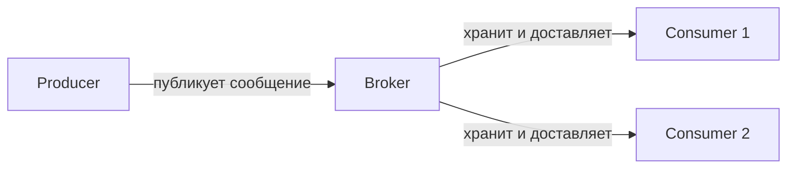
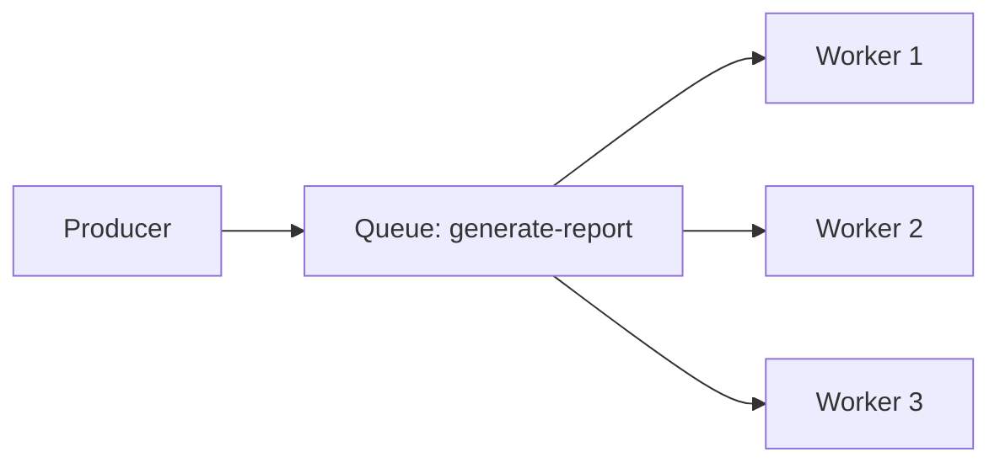
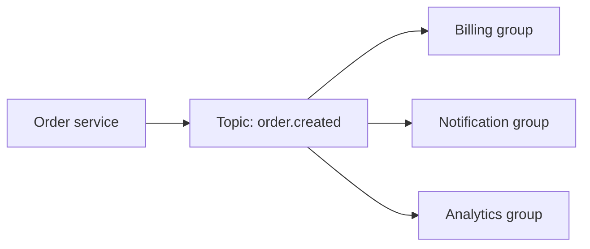
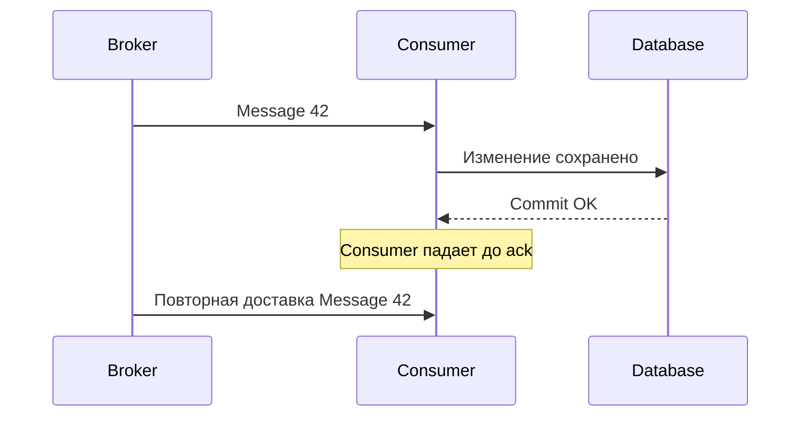
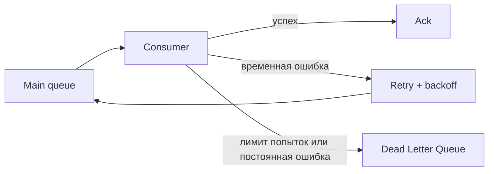
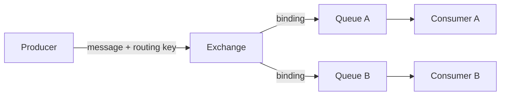
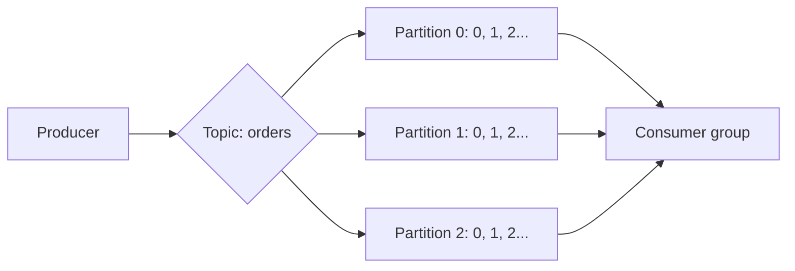
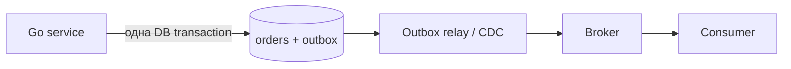

# Брокеры сообщений

**Брокер сообщений** — промежуточный сервис, который принимает сообщения от одних программ или сервисов, временно хранит и передаёт их другим.

Чаще всего речь действительно идёт о **микросервисах**. Но producer и consumer могут быть любыми отдельными программами: частями монолита, фоновыми workers, внешними системами или устройствами.

Брокер позволяет сервисам взаимодействовать **асинхронно**: producer может отправить сообщение и продолжить работу, не ожидая завершения consumer. Это уменьшает связанность компонентов, сглаживает всплески нагрузки и позволяет повторять обработку после временных сбоев.

Для собеседования на middle-уровень в первую очередь достаточно понимать:

- роли producer, broker и consumer;
- разницу queue и topic;
- зачем нужны ack, retry и DLQ;
- почему сообщения могут приходить повторно;
- как устроены RabbitMQ exchange и queue;
- что такое Kafka topic, partition, offset и consumer group;
- базовый выбор между RabbitMQ и Kafka.

Transactional Outbox, схемы сообщений и подробная эксплуатация — полезное углубление, но их можно изучать после этого базиса.



## Зачем нужен брокер

### Слабая связанность

Producer знает адрес и контракт брокера, но ему не обязательно знать адреса, количество и состояние consumers. Новый consumer можно добавить без изменения producer.

### Асинхронная обработка

Пользователь создаёт заказ, API быстро сохраняет его и публикует событие `OrderCreated`. Отдельные consumers могут отправить пользователю уведомление и передать сведения о заказе в систему аналитики.

### Буферизация нагрузки

Если producer временно создаёт 10 000 задач в секунду, а consumers обрабатывают 3 000, брокер накапливает backlog. Consumers разберут его позже, если хранилища и срок хранения рассчитаны на такой объём.

### Отказоустойчивость

Если consumer временно недоступен, сообщение может остаться в брокере и быть доставлено после восстановления.

**Репликация** — хранение копий сообщений на нескольких узлах брокера. Если один узел сломается, другой узел с копией сможет продолжить работу. Репликация защищает от отказа узла, но не заменяет подтверждения обработки со стороны consumer.

### Масштабирование

Можно запустить несколько экземпляров consumer и распределить между ними работу.

## Основные термины

| Термин | Значение |
|---|---|
| **Message** | данные и метаданные, передаваемые через брокер |
| **Producer / publisher** | приложение, публикующее сообщения |
| **Broker** | сервер или кластер, принимающий, хранящий и доставляющий сообщения |
| **Consumer / subscriber** | приложение, читающее и обрабатывающее сообщения |
| **Queue** | очередь задач, из которой одно сообщение обычно обрабатывает один consumer |
| **Topic** | именованный поток событий, на который могут независимо подписаться несколько групп |
| **Acknowledgement, ack** | подтверждение успешного приёма или обработки |
| **Offset** | позиция записи внутри partition Kafka |
| **Partition** | одна упорядоченная часть Kafka topic; позволяет читать topic параллельно |
| **Replication** | хранение копий данных брокера на нескольких узлах |
| **Consumer group** | группа consumers, совместно делящая сообщения или partitions |
| **Routing key** | ключ, по которому RabbitMQ exchange выбирает очередь |
| **DLQ / DLX** | место или маршрут для сообщений, которые не удалось обработать |

### Message, event и command

**Message** — транспортная оболочка. Внутри неё может находиться:

- **event** — факт, который уже произошёл: `OrderCreated`;
- **command** — просьба выполнить действие: `SendReceipt`;
- **document/message** — данные для передачи: результат экспорта, изменение справочника.

Событие обычно называется в прошедшем времени. Producer события не должен диктовать каждому подписчику, что именно с ним делать.

Пример сообщения:

```json
{
  "id": "01JABC...",
  "type": "OrderCreated",
  "version": 1,
  "occurred_at": "2026-08-25T12:00:00Z",
  "correlation_id": "request-123",
  "payload": {
    "order_id": 42,
    "user_id": 7
  }
}
```

Полезно иметь уникальный `id`, тип, версию схемы, время события и `correlation_id` для трассировки.

## Queue и topic

### Queue: распределение работы

Несколько consumers читают одну очередь. Каждое сообщение обычно получает один из них.



Подходит для задач:

- отправить пользователю email или push-уведомление;
- сгенерировать отчёт;
- обработать изображение;
- выполнить фоновую команду.

Это модель **competing consumers**: workers конкурируют за сообщения и делят нагрузку.

### Topic: публикация и подписка

Одно событие нужно нескольким независимым подписчикам.



Каждая группа получает событие независимо. Внутри группы несколько consumers могут делить работу.

| Queue | Topic |
|---|---|
| Обычно одно сообщение — одному worker | Одно событие — каждой подписанной группе |
| Ориентирована на выполнение задачи | Ориентирован на распространение событий |
| После успешной обработки сообщение обычно удаляется | События могут храниться по retention и читаться повторно |
| Масштабирование через competing consumers | Масштабирование внутри каждой consumer group |

Это концептуальное сравнение. В RabbitMQ publish/subscribe строится через exchange и отдельные очереди, а в Kafka consumers разных групп читают общий topic независимо.

## Модели доставки

Распределённая система не может магически узнать, был ли внешний эффект выполнен перед падением consumer. Поэтому нужно понимать гарантии.

| Гарантия | Что происходит | Риск |
|---|---|---|
| **At-most-once** | сообщение обрабатывается не более одного раза | возможно потерять сообщение |
| **At-least-once** | сообщение повторяется, пока не подтверждено | возможны дубликаты |
| **Exactly-once** | эффект должен быть применён ровно один раз | сложно обеспечить end-to-end |

### Почему появляются дубликаты



Broker не получил подтверждение и закономерно доставляет сообщение ещё раз. Поэтому стандартная практическая модель — **at-least-once + идемпотентный consumer**.

Kafka поддерживает идемпотентную публикацию и транзакции для определённых операций внутри Kafka. Это не превращает произвольный HTTP-вызов, отправку email или изменение внешней БД в автоматически exactly-once операцию.

## Идемпотентный consumer

**Идемпотентность** означает, что повторное выполнение операции с тем же сообщением не меняет итог после первого успешного выполнения.

Варианты:

- сохранить `message_id` в таблице обработанных сообщений с `UNIQUE`;
- использовать естественный уникальный ключ бизнес-операции;
- выполнять `UPSERT` вместо безусловного `INSERT`;
- передавать idempotency key во внешний сервис;
- проектировать операцию как установку состояния, а не неограниченное приращение.

```sql
BEGIN;

INSERT INTO processed_messages (consumer, message_id)
VALUES ('billing', $1)
ON CONFLICT DO NOTHING;

-- Если строка добавлена впервые — выполнить бизнес-изменение.
-- Если message_id уже существует — это безопасный дубликат.

COMMIT;
```

Запись `message_id` и бизнес-изменение должны находиться в **одной транзакции БД**. Ack отправляется после успешного commit.

## Retry и Dead Letter Queue

Ошибки делятся на:

- **временные**: timeout, rate limit, кратковременная недоступность БД;
- **постоянные**: неверная схема, отсутствующий обязательный объект, бизнес-запрет.

Временную ошибку можно повторить с ограничением числа попыток и exponential backoff. Немедленный бесконечный requeue создаёт горячий цикл и перегружает систему.



DLQ не является мусорной корзиной. Для неё нужны:

- метрики и alert;
- причина ошибки и число попыток;
- способ посмотреть сообщение;
- контролируемый replay после исправления причины;
- ограничение размера и срока хранения.

## Порядок сообщений

**Глобальный порядок** плохо сочетается с параллелизмом. Обычно нужен порядок только для одной сущности: например, для одного `order_id`.

В Kafka порядок гарантируется **внутри одной partition**. Сообщения с одинаковым key обычно направляют в одну partition:

```text
key = order_id
```

В RabbitMQ очередь стремится доставлять FIFO, но фактический порядок обработки могут изменить:

- несколько активных consumers;
- разные времена обработки;
- redelivery после `nack` или падения;
- priority queues;
- повторная публикация при retry.

Если строгий порядок действительно нужен, уменьшается допустимый параллелизм: одна partition, один active consumer либо последовательная обработка для каждого ключа.

## RabbitMQ

RabbitMQ — классический message broker. В модели AMQP 0-9-1 producer обычно отправляет сообщение не прямо в очередь, а в **exchange**.



### Exchange

Exchange маршрутизирует сообщение в одну или несколько очередей.

| Тип exchange | Правило |
|---|---|
| `direct` | точное совпадение routing key |
| `fanout` | копия во все связанные очереди, routing key игнорируется |
| `topic` | совпадение routing key с шаблоном `*` и `#` |
| `headers` | маршрутизация по заголовкам |

Пример для topic exchange:

```text
message key: orders.eu.created

orders.*.created  → совпадёт
orders.#          → совпадёт
payments.#        → не совпадёт
```

### Подтверждения

В RabbitMQ есть два независимых подтверждения:

- **publisher confirm**: broker подтверждает producer, что принял публикацию в соответствии с настройками;
- **consumer ack**: consumer подтверждает broker, что обработал доставленное сообщение.

`ack` нужно отправлять **после** бизнес-эффекта. Если отправить до обработки, падение consumer приведёт к потере задачи. При потере соединения до ack сообщение может быть доставлено повторно.

Consumer может выполнить:

- `ack` — обработано успешно;
- `nack/reject` с requeue — вернуть для повтора;
- `nack/reject` без requeue — удалить либо отправить по dead-letter маршруту.

### Надёжность RabbitMQ

Для важных сообщений обычно нужны:

- durable exchange и queue;
- persistent сообщения;
- publisher confirms;
- manual consumer acknowledgements;
- replicated quorum queue для высокой доступности;
- DLX, retry policy и идемпотентный consumer.

Одного флага `persistent` недостаточно для всей цепочки гарантий.

### Prefetch

Prefetch ограничивает число unacked сообщений у consumer. Малое значение улучшает справедливость и ограничивает память, большое может увеличить throughput, но один consumer заберёт большой пакет и будет долго удерживать его.

## Apache Kafka

Kafka — распределённая платформа event streaming. Один topic можно разделить на несколько **partitions**.

Partition — отдельная упорядоченная последовательность сообщений внутри topic. Каждое сообщение записывается только в одну partition. Благодаря этому разные consumers могут параллельно читать разные partitions.

```text
Topic orders
├── Partition 0: сообщение 0 → сообщение 1 → сообщение 2
├── Partition 1: сообщение 0 → сообщение 1
└── Partition 2: сообщение 0 → сообщение 1 → сообщение 2
```

Порядок гарантируется внутри одной partition, но не между разными partitions. Если важен порядок событий одного заказа, их отправляют с одинаковым key, например `order_id`.



### Topic, partition и offset

- topic — логическая категория событий;
- partition — единица порядка и параллелизма;
- offset — позиция записи внутри partition;
- key влияет на выбор partition и помогает сохранить порядок одной сущности;
- retention определяет, как долго записи хранятся по времени или размеру.

Чтение не удаляет запись. Consumer сохраняет свой progress — committed offset — и при необходимости может перечитать старые события, пока они не удалены retention policy.

### Consumer groups

В классической consumer group одна partition в конкретный момент назначена одному consumer группы. Поэтому:

- consumers одной группы делят работу;
- разные группы читают topic независимо;
- число одновременно занятых consumers группы ограничено числом partitions;
- изменение состава группы вызывает перераспределение partitions — rebalance.

Пример: topic имеет 3 partitions.

```text
1 consumer  → читает все 3 partitions
3 consumers → каждый читает примерно одну partition
5 consumers → 2 consumers не получают partition
```

### Commit offset

Если offset зафиксирован **до** завершения обработки, падение может привести к пропуску. Если после обработки — падение между бизнес-эффектом и commit offset приведёт к повтору.

Поэтому для важных операций применяют ручной commit после обработки и делают consumer идемпотентным.

### Репликация

Kafka может хранить копии partition на нескольких brokers. Одна копия является leader, остальные — replicas. Producer и consumers работают с leader, а replicas копируют его данные. Если leader недоступен, одна из актуальных replicas может стать новым leader.

```text
Broker 1: Partition 0 — leader
Broker 2: Partition 0 — replica
Broker 3: Partition 0 — replica
```

## Kafka и RabbitMQ: базовые различия

| Критерий | RabbitMQ | Kafka |
|---|---|---|
| Основная модель | независимые сообщения и очереди задач | распределённый журнал событий |
| Путь сообщения | producer → exchange → queue → consumer | producer → topic partition → consumer group |
| Маршрутизация | богатая broker-side маршрутизация через exchanges и bindings | producer выбирает topic/partition; consumers читают назначенные partitions |
| После обработки | acked сообщение обычно удаляется из очереди | запись остаётся до окончания retention |
| Повторное чтение истории | не основная модель обычной queue | естественная возможность по offset |
| Порядок | очередь стремится к FIFO, но параллелизм и redelivery влияют | гарантирован внутри partition |
| Масштабирование consumers | competing consumers, prefetch | partitions распределяются внутри consumer group |
| Retry, TTL, DLQ, priority | развитые механизмы на уровне отдельных сообщений | чаще проектируются отдельными topics и логикой приложения |
| Типичная сильная сторона | задачи, команды, сложная маршрутизация, per-message control | event streaming, replay, аналитические потоки, большой последовательный throughput |

Нельзя выбирать только по формуле «Kafka быстрее, RabbitMQ проще». Современные версии обоих продуктов пересекаются по возможностям: у RabbitMQ есть streams, у Kafka развиваются queue-like механизмы. Выбор делают по модели данных, требованиям к replay, маршрутизации, порядку, задержке, throughput и опыту команды.

### Когда чаще выбирают RabbitMQ

- очередь фоновых задач;
- сложная маршрутизация по routing keys;
- TTL, priority, delayed retry и DLQ для отдельных сообщений;
- нужно выдавать задачи competing consumers;
- история событий после обработки не нужна.

### Когда чаще выбирают Kafka

- поток доменных и интеграционных событий;
- одно событие независимо читают многие системы;
- нужен replay и обработка истории;
- высокая пропускная способность и горизонтальное масштабирование через partitions;
- построение data pipeline, CDC, аналитики и stream processing.

Kafka может передавать команды, а RabbitMQ — события. Вопрос не в запрете, а в том, какая модель является основной и сколько пользовательской логики придётся достроить.

## Дополнительно: Transactional Outbox

Проблема dual write:

```text
1. Сохранить заказ в PostgreSQL
2. Опубликовать OrderCreated в broker
```

Между шагами приложение может упасть. Если запись в БД прошла, а публикация нет, системы разойдутся. Обычная транзакция PostgreSQL не включает внешний broker.

**Transactional Outbox** сохраняет бизнес-изменение и будущую публикацию в одной локальной транзакции.



Шаги:

1. записать `orders` и `outbox` в одной транзакции;
2. relay читает неопубликованные записи;
3. публикует их в broker;
4. отмечает публикацию;
5. consumer защищён от дубликатов.

Relay тоже может упасть после publish и до отметки, поэтому повторная публикация возможна. Outbox решает потерю события, но не отменяет идемпотентность consumer.

## Практический consumer на Go

Конкретный клиент отличается для RabbitMQ и Kafka, но безопасная бизнес-часть одинакова:

```go
type Message struct {
	ID      string
	Payload []byte
}

type Delivery interface {
	Message() Message
	Ack() error
	Retry() error
	Reject() error
}

func Handle(ctx context.Context, db *sql.DB, d Delivery) error {
	msg := d.Message()

	tx, err := db.BeginTx(ctx, nil)
	if err != nil {
		return d.Retry()
	}
	defer tx.Rollback()

	result, err := tx.ExecContext(ctx, `
		INSERT INTO processed_messages (consumer, message_id)
		VALUES ('billing', $1)
		ON CONFLICT DO NOTHING
	`, msg.ID)
	if err != nil {
		_ = tx.Rollback()
		return d.Retry()
	}

	inserted, err := result.RowsAffected()
	if err != nil {
		_ = tx.Rollback()
		return d.Retry()
	}
	if inserted == 0 {
		if err := tx.Commit(); err != nil {
			return d.Retry()
		}
		return d.Ack()
	}

	if err := applyBusinessChange(ctx, tx, msg.Payload); err != nil {
		_ = tx.Rollback()
		return d.Reject() // на практике различай временные и постоянные ошибки
	}
	if err := tx.Commit(); err != nil {
		_ = tx.Rollback()
		return d.Retry()
	}

	return d.Ack()
}
```

Это упрощённая схема, а не универсальный adapter. В production:

- временные и постоянные ошибки обрабатываются по-разному;
- ack/commit ошибки логируются и классифицируются;
- число повторов ограничивается;
- shutdown прекращает приём новых сообщений и дожидается текущих в пределах timeout;
- в логи и trace передаются `message_id` и `correlation_id`.

Популярные Go-клиенты: официальный `rabbitmq/amqp091-go`; для Kafka — `franz-go`, `kafka-go` и клиенты на базе `librdkafka`. Выбор клиента не меняет базовые гарантии брокера.

## Дополнительно: контракты сообщений

Сообщения — публичный API между сервисами. Нельзя бездумно менять или удалять поля.

Рекомендации:

- добавляй новые необязательные поля совместимо;
- consumer должен терпимо относиться к неизвестным полям;
- не меняй смысл существующего поля;
- указывай версию события или используй schema registry;
- проверяй контракт producer и consumer в CI;
- не помещай большие файлы в broker — храни файл в object storage, передавай ссылку и метаданные;
- не отправляй секреты и лишние персональные данные.

## Дополнительно: наблюдаемость

Для broker-based системы важны:

- глубина очереди или consumer lag;
- возраст самого старого необработанного сообщения;
- throughput публикации и обработки;
- процент ошибок и retries;
- количество сообщений в DLQ;
- время обработки;
- rebalance Kafka consumer groups;
- число unacked сообщений RabbitMQ;
- заполнение диска и состояние replicas.

Большая очередь сама по себе не всегда авария. Важнее, растёт ли backlog постоянно и успевает ли система обработать его в пределах бизнес-SLA.

## Типичные ошибки

- считать, что at-least-once исключает дубликаты;
- отправлять ack или commit offset до бизнес-эффекта;
- делать бесконечный немедленный retry;
- не иметь DLQ либо никогда её не разбирать;
- полагаться на глобальный порядок при нескольких consumers;
- менять формат сообщения без совместимости;
- публиковать событие отдельно от транзакции БД без outbox;
- использовать broker как основную БД без понимания retention;
- не ограничивать размер сообщения;
- игнорировать backpressure, lag и заполнение диска;
- выбирать Kafka или RabbitMQ только по популярности;
- синхронно ждать ответа через broker там, где обычный HTTP/gRPC проще и понятнее.

## Когда брокер не нужен

Не каждое взаимодействие следует делать асинхронным. Прямой HTTP/gRPC-запрос обычно лучше, если:

- вызывающему нужен немедленный ответ;
- операция простая и короткая;
- строгая согласованность важнее временной автономности;
- в системе мало компонентов и broker добавит больше сложности, чем пользы.

Часто применяют оба подхода: синхронный запрос для немедленного результата и событие для независимых последующих реакций.

## Что важно на собеседовании

### Кто такие producer, broker и consumer?

Producer публикует сообщение, broker принимает, хранит и доставляет его, consumer читает и выполняет обработку.

### Чем queue отличается от topic?

Queue обычно распределяет каждую задачу одному worker. Topic позволяет нескольким независимым подписчикам или группам получить одно событие.

### Что такое at-least-once?

Broker старается не потерять сообщение и при неопределённости доставляет его повторно. Поэтому consumer обязан корректно переживать дубликаты.

### Почему exactly-once сложно?

Broker не контролирует произвольные внешние эффекты. Consumer может сохранить результат и упасть до подтверждения, после чего сообщение придёт повторно.

### Когда отправлять ack или commit offset?

После успешного бизнес-эффекта. Иначе возможна потеря. После обработки возможен повтор, поэтому требуется идемпотентность.

### Как RabbitMQ маршрутизирует сообщение?

Producer публикует в exchange с routing key. Exchange по своему типу и bindings направляет сообщение в одну или несколько очередей.

### Как Kafka сохраняет порядок?

Порядок существует внутри partition. События одной сущности отправляют с одинаковым key, чтобы они попадали в одну partition.

### Как масштабируется Kafka consumer group?

Partitions распределяются между consumers группы. В классической модели одна partition одновременно читается одним consumer этой группы; consumers сверх числа partitions простаивают.

### Что происходит с сообщением после чтения?

В RabbitMQ после consumer ack сообщение обычной queue удаляется. В Kafka запись остаётся до retention, а группа сохраняет offset своего чтения.

### Для чего нужен DLQ?

Для изоляции сообщений, которые исчерпали retries или не могут быть обработаны. DLQ требует мониторинга, анализа причины и контролируемого replay.

### Что решает Transactional Outbox?

Он атомарно сохраняет бизнес-изменение и намерение опубликовать событие в одной БД, устраняя окно потери между database commit и publish.

### Kafka или RabbitMQ?

RabbitMQ чаще удобнее для очередей задач и сложной маршрутизации отдельных сообщений. Kafka — для долговременного event log, replay, многих consumer groups и потоковой обработки. Выбор подтверждают конкретные требования.

## Что важно запомнить

1. Producer создаёт сообщение, broker хранит и маршрутизирует, consumer обрабатывает.
2. Queue распределяет задачи, topic распространяет события независимым группам.
3. Основная практическая гарантия — at-least-once, поэтому дубликаты нормальны.
4. Ack или offset commit делается после бизнес-эффекта.
5. Идемпотентность — ответственность приложения, а не только broker.
6. Порядок Kafka действует внутри partition; параллелизм ограничен их количеством.
7. RabbitMQ использует exchange, bindings и queues; Kafka — topics, partitions, offsets и consumer groups.
8. Retry должен иметь лимит и backoff, а DLQ — мониторинг и процесс разбора.
9. Transactional Outbox предотвращает потерю события при dual write.
10. Kafka и RabbitMQ решают пересекающиеся, но разные основные задачи; универсального победителя нет.

## Источники

- [Selectel — что такое брокер сообщений, для каких задач нужен и какой выбрать](https://selectel.ru/blog/message-broker/)
- [Хабр / Сбер — брокеры сообщений, Apache Kafka и RabbitMQ](https://habr.com/ru/companies/sberbank/articles/669456/)
- [Apache Kafka — Introduction](https://kafka.apache.org/intro/)
- [Apache Kafka — KafkaConsumer API и управление offset](https://kafka.apache.org/43/javadoc/org/apache/kafka/clients/consumer/KafkaConsumer.html)
- [RabbitMQ — AMQP 0-9-1 Model Explained](https://www.rabbitmq.com/tutorials/amqp-concepts)
- [RabbitMQ — Exchanges](https://www.rabbitmq.com/docs/exchanges)
- [RabbitMQ — Consumer Acknowledgements and Publisher Confirms](https://www.rabbitmq.com/docs/confirms)
- [RabbitMQ — Queues](https://www.rabbitmq.com/docs/queues)
- [RabbitMQ — Quorum Queues](https://www.rabbitmq.com/docs/quorum-queues)

## Видео для закрепления

- [Микросервисы на пальцах. Брокеры, Kafka, RabbitMQ, Event Sourcing](https://www.youtube.com/watch?v=lEGFm474LKI) — **рус.**, короткое объяснение роли брокеров и различий Kafka/RabbitMQ.
- [Apache Kafka Fundamentals](https://www.youtube.com/watch?v=B5j3uNBH8X4) — **англ.**, topics, partitions, log, brokers, producers, consumers, groups и offsets.
