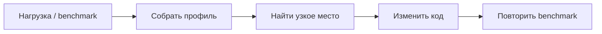

# Тестирование: pprof и race detector

Два полезных инструмента Go для backend-разработчика:

| Инструмент | Что ищет |
|---|---|
| `pprof` | почему программа тратит CPU, память или ждёт блокировку |
| `go test -race` | небезопасный одновременный доступ goroutines к памяти |

Они не заменяют друг друга: pprof не ищет race, а race detector не показывает узкие места производительности.

## pprof

**pprof** — профилировщик: он показывает, где программа тратит ресурсы. Сначала собирают профиль под характерной нагрузкой, потом меняют только подтверждённое узкое место и повторяют измерение.



### Главное, что нужно знать

| Профиль | Когда нужен |
|---|---|
| CPU | сервис медленный или потребляет много CPU |
| Heap | рост памяти, частый GC, подозрение на утечку |
| Goroutine | зависания и утечки goroutines |
| Block / mutex | ожидание канала, lock или высокая конкуренция за mutex |

CPU показывает только активные вычисления. Если goroutine ждёт сеть, канал или mutex, смотри goroutine, block или mutex profile.

### Локально через benchmark

```bash
go test -run '^$' -bench . -benchmem \
  -cpuprofile cpu.out \
  -memprofile mem.out

go tool pprof -http=:0 cpu.out
go tool pprof -http=:0 mem.out
```

- `-run '^$'` не запускает обычные тесты;
- `-bench .` запускает benchmarks;
- `-benchmem` показывает аллокации;
- `-http=:0` открывает web-интерфейс на свободном порту.

В pprof смотри:

- `top` — самые дорогие функции;
- `top -cum` — самые дорогие цепочки вызовов;
- `list FunctionName` — стоимость по строкам функции;
- flame graph — широкий блок означает дорогой путь.

`flat` — стоимость самой функции; `cum` — функции вместе с тем, что она вызвала. Если высоко `runtime.mallocgc`, ищи выше по стеку код, который создаёт много объектов.

### HTTP-сервис

```go
import _ "net/http/pprof"

// Только для локальной разработки или закрытого debug-порта.
http.ListenAndServe("127.0.0.1:6060", nil)
```

```bash
# CPU-профиль за 15 секунд
go tool pprof "http://127.0.0.1:6060/debug/pprof/profile?seconds=15"

# Heap
go tool pprof "http://127.0.0.1:6060/debug/pprof/heap"
```

**Не публикуй `/debug/pprof` в открытый интернет.** В production снимай профиль на одной реплике, короткое время и через закрытый debug-порт.

## Race detector

**Data race** возникает, когда две goroutines одновременно обращаются к одной переменной, хотя бы одна операция — запись, и доступы не синхронизированы.

```bash
go test -race ./...
go test -race -count=100 ./internal/...
go run -race ./cmd/app
```

`-race` запускает более медленную и требовательную к памяти инструментированную программу. Обычно его используют локально, в CI и на staging.

### Пример race

```go
type Counter struct {
	value int
}

func (c *Counter) Inc() {
	c.value++ // несколько goroutines могут читать и писать одновременно
}
```

Исправление через mutex:

```go
type Counter struct {
	mu    sync.Mutex
	value int
}

func (c *Counter) Inc() {
	c.mu.Lock()
	defer c.mu.Unlock()
	c.value++
}

func (c *Counter) Value() int {
	c.mu.Lock()
	defer c.mu.Unlock()
	return c.value
}
```

Для простого счётчика или флага подойдёт `sync/atomic`. Для нескольких связанных полей обычно нужен mutex или один владелец данных — goroutine, с которой общаются через channel.

### Частые причины

- чтение и запись в `map` из разных goroutines;
- общий счётчик, срез или поле структуры без синхронизации;
- одна goroutine изменила данные, пока другая их читает;
- повторное использование mutable объекта, например `bytes.Buffer`;
- попытка исправить проблему через `time.Sleep`.

Race detector показывает два конфликтующих stack trace и места создания goroutines. Нужно найти общую переменную и договориться, кто и как защищает все её чтения и записи.

**Важно:** detector находит только race, которая реально произошла при запуске. Поэтому тесты должны запускать параллельную работу и иногда повторяться с `-count`.

## Типичные ошибки

- оптимизировать без benchmark и профиля;
- снимать pprof без нормальной нагрузки;
- считать отсутствие отчёта `-race` доказательством отсутствия всех гонок;
- игнорировать race, которая «исчезает» без флага;
- открывать pprof endpoint наружу;
- использовать `atomic` для операции, где нужно изменить несколько полей согласованно.

## Что важно на собеседовании

### Чем pprof отличается от race detector?

pprof измеряет ресурсы и находит узкие места. Race detector ищет небезопасный конкурентный доступ к памяти.

### Какие pprof-профили нужно помнить?

CPU, heap, goroutine, block и mutex.

### Что такое data race?

Две goroutines обращаются к одной переменной одновременно, хотя бы одна пишет, а синхронизации нет.

### Почему `go test -race` не гарантирует отсутствие всех races?

Проверяются только реально выполненные пути программы. Непокрытый тестами сценарий detector не увидит.

### Когда mutex, а когда atomic?

Atomic — для простого независимого счётчика или флага. Mutex — для связанного состояния и нескольких операций, которые должны быть единым действием.

## Что важно запомнить

1. Сначала измеряй pprof, потом оптимизируй и снова измеряй.
2. CPU — вычисления, heap — память, block/mutex — ожидание синхронизации.
3. `go test -race ./...` — базовая проверка конкурентного кода.
4. Race исправляют синхронизацией, а не `Sleep`.
5. pprof endpoints должны быть закрыты от публичного доступа.

## Источники

- [Go — Diagnostics](https://go.dev/doc/diagnostics)
- [Go — Data Race Detector](https://go.dev/doc/articles/race_detector)
- [Go — Profiling Go Programs](https://go.dev/blog/pprof)
- [runtime/pprof](https://pkg.go.dev/runtime/pprof)
- [net/http/pprof](https://pkg.go.dev/net/http/pprof)

## Видео для закрепления

- [Основные инструменты профилирования в Go](https://www.youtube.com/watch?v=DBFteoKbEvY) — **рус.**, benchmarks, pprof и flame graph.
- [Go (Golang) Profiling Tutorial](https://www.youtube.com/watch?v=HEwSkhr_8_M) — **англ.**, CPU/heap profiles и `net/http/pprof`.
