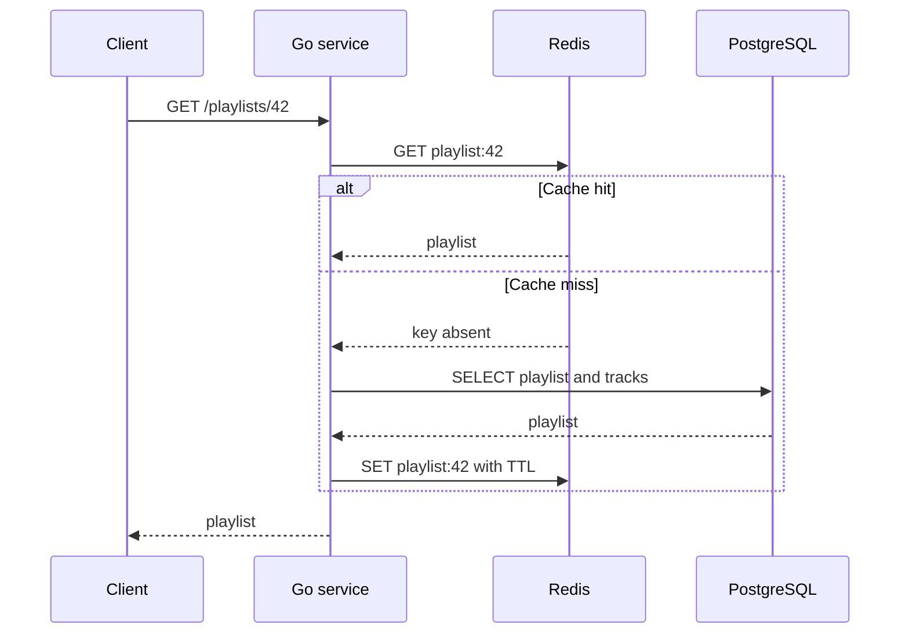

# Redis и кеширование

**Кеш** хранит часто запрашиваемые данные ближе к приложению, чтобы не обращаться к основной БД при каждом чтении. Redis часто используют как распределённый кеш: несколько экземпляров Go-сервиса видят одни и те же ключи.

Главное правило: при таком использовании **PostgreSQL остаётся источником истины**, а Redis можно безопасно очистить и заполнить заново.

## Ключ-значение, TTL и eviction

Redis хранит данные по схеме **ключ → значение**. Например, ключ `playlist:42` может содержать JSON с плейлистом, а `user:42:sessions` — набор сессий пользователя.

- **TTL (time to live)** — время жизни ключа. После истечения Redis удаляет ключ; следующий запрос станет промахом кеша.
- **Eviction** — принудительное удаление ключей при нехватке памяти по выбранной политике Redis. Поэтому ключ может исчезнуть и до окончания TTL.

TTL ограничивает время, в течение которого данные могут устаревать, и не даёт бесконечно копить записи. Но TTL не заменяет инвалидацию после важных изменений.

## Cache-aside: чтение playlist

**Cache-aside** — приложение само сначала читает кеш. При отсутствии данных оно читает основную БД и кладёт результат в кеш.



При **cache hit** сервис сразу возвращает данные из Redis. При **cache miss** он идёт в PostgreSQL, возвращает ответ клиенту и записывает результат в Redis с TTL. Ошибку Redis обычно не превращают в ошибку чтения: сервис читает из PostgreSQL и продолжает работу без кеша.

## Кто инвалидирует кеш после CRUD

Инвалидацией управляет **сервис, который выполняет изменение**. После успешного `CREATE`, `UPDATE` или `DELETE` он сначала фиксирует изменения в PostgreSQL, затем удаляет или обновляет связанные ключи Redis.

Для cache-aside простой и надёжный вариант — удалить ключ:

```text
UPDATE playlist в PostgreSQL успешно завершён
→ DEL playlist:42
→ следующий GET загрузит актуальную версию из PostgreSQL
```

Если кешируются списки, их тоже нужно инвалидировать: например, `user:7:playlists`. В микросервисной системе сервис-владелец данных может публиковать событие об изменении, а потребители удалят свои кеш-ключи.

## Стратегии записи

| Подход | Что происходит при записи | Нюанс |
|---|---|---|
| **Cache-aside** | Сначала БД, затем удалить или обновить кеш | Самый частый вариант для backend |
| **Write-through** | Запись синхронно проходит через кеш в БД | Данные в кеше обновляются сразу, но запись медленнее |
| **Write-behind** | Сначала запись в кеш, БД обновляется позже асинхронно | Быстро, но возможна потеря ещё не сохранённых данных при сбое |

## Типичные проблемы

### Устаревшие данные

**Stale data** — данные в кеше уже не соответствуют PostgreSQL. Причины: забыли удалить ключ после изменения, TTL слишком большой или запись в Redis не выполнилась. Снижают риск корректной инвалидацией, разумным TTL и выбором данных, для которых допустима небольшая задержка обновления.

### Cache stampede

**Cache stampede** — много запросов одновременно обнаружили промах одного ключа и все пошли в PostgreSQL. Это может перегрузить БД.

Защита: один запрос получает короткий lock на ключ и заполняет кеш; остальные немного ждут и повторно читают Redis. Дополнительно используют случайное отклонение TTL, чтобы популярные ключи не истекали одновременно.

### Cache penetration

**Cache penetration** — частые запросы к несуществующему объекту, например `GET /playlists/999999`, каждый раз доходят до БД. Можно ненадолго кешировать факт отсутствия объекта или проверять допустимость идентификатора до обращения к БД.

### Distributed lock

**Распределённая блокировка** нужна, когда несколько экземпляров сервиса должны договориться, что работу выполнит только один: например, заполнит дорогой ключ кеша.

Для lock в Redis используют уникальный токен владельца и короткий TTL. Освобождать блокировку может только тот, кто её получил: нельзя просто безусловно удалить ключ, иначе можно удалить lock нового владельца после истечения старого TTL. Lock — точечный инструмент; он не заменяет транзакции PostgreSQL и требует обработки истечения TTL и сбоев.

## Почему Redis нельзя считать основной БД по умолчанию

Redis может сохранять данные на диск и подходит не только для кеша. Но в роли кеша он не должен быть единственным хранилищем бизнес-данных:

- ключи могут исчезнуть по TTL или из-за eviction;
- при сбое Redis кеш должен быть восстанавливаем из PostgreSQL;
- сложные связи, ограничения и транзакции бизнес-данных обычно естественнее моделировать в реляционной БД.

Redis делают основной БД только при осознанном выборе архитектуры, требований к надёжности и настроенной стратегии хранения и восстановления данных.

## Что важно на собеседовании

1. При cache-aside промах означает: прочитать PostgreSQL → записать в Redis с TTL → вернуть данные.
2. Инвалидацию после CRUD выполняет сервис, который изменил источник истины; обычно после успешной записи в БД удаляют связанные ключи кеша.
3. `TTL` — ожидаемое истечение ключа, eviction — удаление из-за политики памяти.
4. Redis ускоряет чтение, но кеш может быть неполным или устаревшим. PostgreSQL должна отвечать за бизнес-данные.
5. Lock помогает от stampede, но должен иметь TTL и уникальный токен владельца.

## Источники

- [Redis: cache-aside](https://redis.io/docs/latest/develop/use-cases/cache-aside/)
- [Redis: строки и ключ-значение](https://redis.io/docs/latest/develop/data-types/strings/)
- [Redis: EXPIRE и TTL](https://redis.io/docs/latest/commands/expire/)
- [Redis: eviction](https://redis.io/docs/latest/develop/reference/eviction/)
- [Redis: распределённые блокировки](https://redis.io/docs/latest/develop/clients/patterns/distributed-locks/)

## Видео для закрепления

1. [Быстрый бэкенд с Redis: кеширование, сессии и приёмы ускорения](https://www.youtube.com/watch?v=MdCNtJXSME0) — рус., TTL и паттерны использования Redis.
2. [Redis & Caching Strategies Explained](https://www.youtube.com/watch?v=mRU2PsyOLRk) — англ., cache-aside, TTL и инвалидация.
