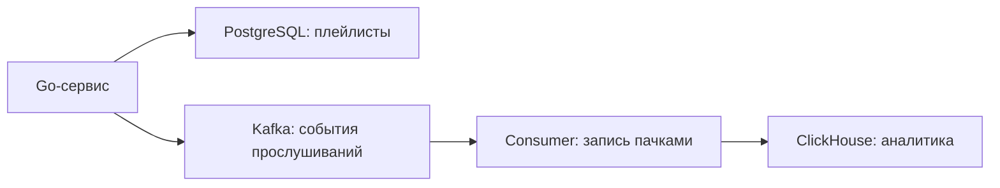

# ClickHouse

**ClickHouse** — колоночная аналитическая СУБД. Она хорошо подходит для агрегирования большого количества событий: сколько раз слушали треки, как менялась выручка, какие запросы были медленными.

## OLTP и OLAP

| | PostgreSQL: типичная OLTP-нагрузка | ClickHouse: типичная OLAP-нагрузка |
|---|---|---|
| Задача | Обработать отдельную бизнес-операцию | Проанализировать много данных |
| Пример | Создать плейлист, списать остаток | Посчитать прослушивания за месяц |
| Запросы | Небольшие чтения и изменения строк | Чтение выбранных колонок и агрегации |
| Приоритет | Транзакции и ограничения | Пропускная способность аналитики |

**OLTP** — оперативная обработка транзакций; **OLAP** — аналитическая обработка данных. Это типы нагрузки, а не запрет PostgreSQL на аналитику. ClickHouse поддерживает SQL и не обязан относиться к категории «NoSQL».

## Почему колоночное хранение помогает

При `SELECT track_id, count(*)` не нужно читать текст названия, описание и другие ненужные колонки. Значения одного типа хорошо сжимаются, а обработка блоками уменьшает накладные расходы.



Схема — один из вариантов: Kafka не обязательна для ClickHouse. Аналитические данные могут поступать с задержкой; основной пользовательский CRUD не обязан ждать их загрузки.

## MergeTree: что достаточно знать

**MergeTree** — семейство движков таблиц. Данные записываются в отсортированные части (**parts**), которые сервер постепенно объединяет в фоне.

```sql
CREATE TABLE plays (
    event_id UUID,
    played_at DateTime,
    track_id UInt64,
    user_id UInt64
) ENGINE = MergeTree
PARTITION BY toYYYYMM(played_at)
ORDER BY (track_id, played_at);
```

- `ORDER BY` задаёт сортировку данных. Первичный индекс обычно связан с этим ключом и помогает пропускать ненужные диапазоны.
- Индекс **разреженный**: содержит отметки для групп строк, а не адрес каждой строки, как часто представляют индекс OLTP-БД.
- **Primary key не обеспечивает уникальность.** Две строки с одинаковыми `event_id` или ключом сортировки не будут автоматически отклонены.
- `PARTITION BY` разделяет данные для управления ими, например удаления старых месяцев. Это не Kafka partition и не автоматическое шардирование между серверами.

Порядок ключа выбирают под частые запросы. Пример удобен для истории конкретного трека, но не является универсально лучшим для всех отчётов по времени.

## Запись, обновления и дубликаты

Множество одиночных `INSERT` создаёт слишком много мелких parts. Обычно события отправляют **пачками**, используя batch API драйвера, либо настраивают асинхронные вставки на сервере.

При async insert важно, что означает успешный ответ. `wait_for_async_insert=1` позволяет дождаться сброса буфера в таблицу и получить ошибку этой записи; режим без ожидания даёт более слабое подтверждение.

Обновления, удаления и JOIN существуют, но не стоит проектировать ClickHouse как обычную БД с частым изменением отдельных строк. Стоимость операции зависит от движка и механизма изменения.

**ReplacingMergeTree** может устранять версии строк с одинаковым ключом сортировки при слияниях. Это не немедленный `UNIQUE`: до слияния запрос способен увидеть несколько версий. `FINAL` применяет соответствующую обработку при чтении, но имеет стоимость. Повторы событий нужно учитывать при проектировании подсчётов, а не надеяться на название движка.

## Практика в Go

- Переиспользовать клиент и его пул, задавать дедлайны через `context`.
- Передавать значения параметрами, закрывать результаты и проверять ошибки чтения.
- Ограничивать размер и время накопления batch, учитывать backpressure — замедлять приём, если запись не успевает.
- При неопределённом результате вставки учитывать возможные дубликаты при повторе.
- Для диагностики смотреть `EXPLAIN`, объём прочитанных строк/байтов и `system.query_log`, а не только время ответа.

## Что важно на собеседовании

1. **Почему быстрее на аналитике?** Читает нужные колонки, сжимает данные и обрабатывает их блоками; ключ сортировки позволяет пропускать часть данных.
2. **Можно заменить PostgreSQL?** Для типичного сервиса с CRUD и связанными транзакциями — обычно это разные роли, а не взаимозаменяемые решения.
3. **Почему нельзя писать по одной строке?** Можно, но большое число мелких вставок увеличивает количество parts и работу фоновых слияний.
4. **Primary key уникален?** Нет. Дедупликация и корректность агрегатов требуют отдельного решения.

**Запомнить:** ClickHouse — аналитика по большим объёмам, колонки, сортировка и пакетная запись. Глубокая настройка кластера нужна прежде всего для вакансий с ClickHouse в рабочем стеке.

## Источники

- [ClickHouse: MergeTree](https://clickhouse.com/docs/reference/engines/table-engines/mergetree-family/mergetree)
- [ClickHouse: ReplacingMergeTree](https://clickhouse.com/docs/reference/engines/table-engines/mergetree-family/replacingmergetree)
- [ClickHouse: стратегии вставки](https://clickhouse.com/docs/concepts/best-practices/selecting-an-insert-strategy)
- [ClickHouse: Go-клиенты](https://clickhouse.com/docs/integrations/language-clients/go/index)

## Видео для закрепления

1. [Евгений Климов — ClickHouse, UWDC](https://www.youtube.com/watch?v=AG7QbL5_LMo) — рус., устройство и практические особенности ClickHouse; детали можно смотреть после базиса.
2. [Introduction to ClickHouse — Auckland meetup](https://clickhouse.com/videos/auckland-meetup-intro-to-clickhouse) — англ., вводный доклад на сайте ClickHouse.
