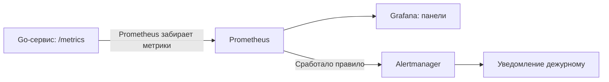

# Prometheus и Grafana

**Наблюдаемость (observability)** помогает понять состояние сервиса по его внешним сигналам. Для backend важно не только написать обработчик, но и заметить рост ошибок, задержек или очередей.

## Метрики, логи и трассировки

| Сигнал | На какой вопрос отвечает | Пример |
|---|---|---|
| Метрики | Что происходит в целом? | Доля ошибок, p95 задержки |
| Логи | Что случилось в конкретной операции? | Ошибка SQL с request ID |
| Трассировки | Где запрос потратил время между сервисами? | HTTP → сервис → БД |

**Trace** — путь операции; **span** — отдельный участок с временем начала и длительностью. Trace ID связывает участки и может добавляться в структурированные логи, например через `log/slog` в Go. Пароли и токены в логи не пишут.

**OpenTelemetry** — инструменты и стандарты для сбора и передачи телеметрии. Это не готовая БД для её хранения и не замена Grafana.

## Кто за что отвечает



- **Prometheus** периодически опрашивает HTTP endpoint с метриками (**scrape**), хранит временные ряды и выполняет запросы на языке **PromQL**.
- **Grafana** строит панели по данным Prometheus и других источников. Сама панель не собирает метрики из приложения.
- **Alertmanager** группирует, подавляет и маршрутизирует уведомления. У Grafana также есть собственная система alerting; не нужно считать эти роли одной программой.

## Типы метрик

| Тип | Для чего | Пример |
|---|---|---|
| Counter | Нарастающее число событий; после рестарта может сброситься | `http_requests_total` |
| Gauge | Текущее значение, растёт и уменьшается | Число активных соединений |
| Histogram | Распределение наблюдений | Длительность HTTP-запросов |
| Summary | Наблюдения и вычисляемые на клиенте квантили | Локальная оценка задержек |

Для скорости событий используют `rate(counter[5m])`, а не текущее накопленное значение счётчика. `rate` учитывает сбросы счётчика.

**p95** — задержка, не превышенная примерно в 95% наблюдений. Среднее может скрывать редкие медленные запросы. Нельзя усреднить p95 нескольких реплик и получить общий p95.

Пример для **классической** гистограммы с подходящими границами buckets:

```promql
histogram_quantile(
  0.95,
  sum by (le) (rate(http_request_duration_seconds_bucket[5m]))
)
```

Сначала объединяем buckets реплик, затем оцениваем квантиль. У native histograms другой формат запроса; перед копированием примера нужно проверить тип метрики. Квантили histogram — оценка с точностью, зависящей от её настройки.

## Labels и кардинальность

**Label** — измерение метрики: `method="GET"`, `route="/playlists/{id}"`, `status="200"`. Каждая уникальная комбинация labels создаёт отдельный временной ряд.

**Кардинальность** — количество таких комбинаций. Нельзя бездумно добавлять `user_id`, `playlist_id`, request ID или полный URL: число рядов может резко вырасти. Для отдельных запросов подходят логи и traces, для метрик — ограниченные категории.

## Что измерять в Go-сервисе

- HTTP: частоту запросов, долю ошибок и длительность — подход **RED**: rate, errors, duration.
- Ресурсы: CPU, память, количество горутин, GC.
- БД: занятые соединения, ожидание пула, задержки и ошибки SQL.
- Брокер: lag, повторы и размер DLQ; кеш: hit ratio и задержки.

Метрики регистрируют один раз; endpoint защищают от ненужного внешнего доступа. Бизнес-метрики отделяют от технических: успешный HTTP-ответ ещё не означает успешную оплату.

**SLI** — измеряемый показатель качества, например доля успешных запросов. **SLO** — цель для показателя за период. Алерт должен вести к действию: «ошибки держатся 5 минут и нарушают цель», а не сообщать о каждом коротком скачке CPU.

## Что важно на собеседовании

1. **Prometheus против Grafana?** Сбор/хранение/запросы метрик против визуализации данных из источников.
2. **Counter или gauge?** Число обработанных запросов — counter; текущая длина очереди — gauge.
3. **Почему нельзя label с user ID?** Неограниченная кардинальность, рост памяти и стоимости запросов.
4. **Что делать при росте p95?** Сопоставить нагрузку, ошибки и ресурсы; по traces найти медленный участок, по логам и профилям — причину. Один график не доказывает источник проблемы.

**Запомнить:** метрики показывают масштаб, логи — события, traces — путь запроса. Начать с RED и полезных алертов, а не с десятков панелей.

## Источники

- [Prometheus: типы метрик](https://prometheus.io/docs/concepts/metric_types/)
- [Prometheus: именование и labels](https://prometheus.io/docs/practices/naming/)
- [Prometheus: histograms и summaries](https://prometheus.io/docs/practices/histograms/)
- [Grafana: основы](https://grafana.com/docs/grafana/latest/fundamentals/)
- [OpenTelemetry: сигналы](https://opentelemetry.io/docs/concepts/signals/)

## Видео для закрепления

1. [Grafana + Prometheus в Docker, часть 1](https://www.youtube.com/watch?v=7V7mS1cJ5fg) — рус., знакомство с мониторингом и подключением компонентов.
2. [How Does Prometheus Work? — Intellipaat](https://www.youtube.com/watch?v=bVs4jIBO6hc) — англ., архитектура сбора метрик.
