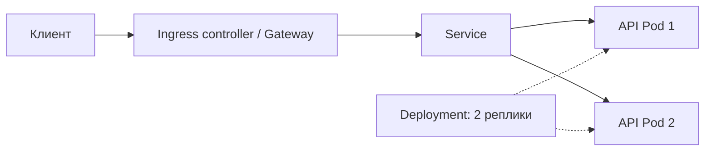

# Kubernetes

**Kubernetes (K8s)** управляет запуском контейнерных приложений на группе машин — кластере. Разработчик описывает желаемое состояние, например три экземпляра API, а контроллеры стремятся его поддерживать.

Для middle backend нужен базис эксплуатации своего приложения: конфигурация, доступность, ресурсы, обновления и диагностика. Устройство control plane во всех деталях — не обязательная отправная точка.

## Главные объекты

| Объект | Зачем нужен |
|---|---|
| Node | Машина, на которой работают приложения |
| Pod | Минимальная единица размещения: один или несколько связанных контейнеров с общей сетью |
| Deployment | Управляет репликами Pod и обновлением stateless-приложения |
| Service | Даёт стабильное имя и адрес группе Pod, выбранных по labels |
| ConfigMap | Несекретная конфигурация |
| Secret | Чувствительная конфигурация; доступ нужно ограничивать |
| PersistentVolumeClaim (PVC) | Запрос постоянного хранилища |

Pod может исчезнуть и быть заменён новым с другим IP. Поэтому API соседнего сервиса вызывают через Service, а не по сохранённому IP Pod.



Ingress описывает HTTP-маршруты, но для обработки трафика нужен установленный controller. Это один из способов внешнего доступа; существуют также `LoadBalancer` Service и Gateway API.

## Readiness, liveness, startup

| Проверка | Вопрос | Что происходит при повторных неудачах |
|---|---|---|
| Readiness | Можно ли направлять сюда трафик? | Pod исключается из готовых endpoints Service |
| Liveness | Нужно ли перезапустить зависший контейнер? | Контейнер перезапускается |
| Startup | Закончилось ли долгое начальное включение? | После порога неудач контейнер перезапускается; до успеха остальные probes не запускаются |

Не включай доступность PostgreSQL в liveness: отказ общей БД иначе вызовет массовые бессмысленные перезапуски API. Readiness тоже проектируют осторожно: временная проблема зависимости не всегда требует убрать все реплики из трафика.

Проверки `/livez` и `/readyz` должны быть реализованы приложением; Kubernetes не добавляет эти обработчики сам.

## Requests и limits

```yaml
resources:
  requests:
    cpu: "100m"
    memory: "128Mi"
  limits:
    cpu: "500m"
    memory: "256Mi"
```

Это фрагмент описания контейнера, а не отдельный запускаемый манифест.

- **Request** учитывается при размещении Pod; `100m` CPU — одна десятая ядра.
- **CPU limit** ограничивает доступное процессорное время: возможно throttling — принудительное замедление.
- **Memory limit** ограничивает память; при превышении возможно завершение процесса с `OOMKilled`.

Для Go учитывают `GOMAXPROCS` и `GOMEMLIMIT`. Современный runtime учитывает CPU-квоты контейнера при выборе значения по умолчанию, но мягкий лимит Go-памяти нужно задавать с запасом относительно лимита контейнера. Он не ограничивает всю память процесса и не защищает от любого OOM.

## Обновление и завершение

**Rolling update** постепенно заменяет старые Pod новыми. Для обновления без заметного простоя нужны готовность новых экземпляров, достаточные ресурсы, корректное завершение и совместимость версий приложения и схемы БД.

Go-сервис при завершении должен:

1. Получить сигнал завершения, обычно `SIGTERM`.
2. Перестать принимать новую работу и дать текущей ограниченное время на завершение, например через `http.Server.Shutdown`.
3. Остановить consumers, освободить ресурсы и выйти до окончания `terminationGracePeriodSeconds`.

Снятие Pod с маршрутизации и завершение не происходят мгновенно и строго последовательно. Нужен запас времени на распространение изменений. Иначе пользовательские запросы оборвутся, даже если replicas больше одной.

## Конфигурация и данные

- Secret с base64 — **не зашифрованный секрет**. Нужны права доступа, защита хранилища и безопасная передача; секреты нельзя коммитить в открытый YAML.
- Файлы в записываемом слое контейнера не подходят для постоянных бизнес-данных. PVC решает вопрос хранения, но сам по себе не создаёт backup или отказоустойчивую БД.
- **StatefulSet** нужен для стабильной идентичности и хранения stateful-экземпляров; он не настраивает автоматически репликацию PostgreSQL.
- **HPA** меняет число реплик по метрикам. Масштабирование API может перегрузить БД суммарным количеством соединений.
- **Helm** упаковывает и параметризует манифесты. Это не отдельный планировщик контейнеров.

## Минимальная диагностика

```bash
kubectl get pods
kubectl describe pod <pod-name>
kubectl logs <pod-name>
kubectl logs <pod-name> --previous
kubectl get events --sort-by=.metadata.creationTimestamp
kubectl rollout status deployment/<deployment-name>
```

`CrashLoopBackOff` — повторяющиеся падения, а не диагноз: смотри предыдущие логи и причину завершения. `Pending` часто связан с ресурсами, размещением или томом. `ImagePullBackOff` — проверить имя образа и доступ к registry. Работай в нужных context и namespace.

## Что важно на собеседовании

1. **Docker Compose или Kubernetes?** Compose удобен для связанного локального окружения; Kubernetes управляет желаемым состоянием, размещением и обновлениями в кластере.
2. **Pod или Deployment?** Pod запускает контейнеры, Deployment управляет их заменой и числом реплик.
3. **Readiness или liveness?** Не направлять трафик против перезапустить контейнер.
4. **Почему две реплики не гарантируют zero downtime?** Нужны probes, graceful shutdown, запас мощности и совместимые изменения БД.

## Источники

- [Kubernetes: Pods](https://kubernetes.io/docs/concepts/workloads/pods/)
- [Kubernetes: Deployment](https://kubernetes.io/docs/concepts/workloads/controllers/deployment/)
- [Kubernetes: Service](https://kubernetes.io/docs/concepts/services-networking/service/)
- [Kubernetes: probes](https://kubernetes.io/docs/concepts/workloads/pods/probes/)
- [Kubernetes: requests и limits](https://kubernetes.io/docs/concepts/configuration/manage-resources-containers/)
- [Kubernetes: Secrets](https://kubernetes.io/docs/concepts/configuration/secret/)
- [Go: container-aware GOMAXPROCS](https://go.dev/blog/container-aware-gomaxprocs)

## Видео для закрепления

1. [Флант: Kubernetes Zero to Hero — Pod и Deployment](https://www.youtube.com/watch?v=wlxKnktHixw) — рус., основные объекты и практика.
2. [Kubernetes in 100 Seconds — Fireship](https://www.youtube.com/watch?v=PziYflu8cB8) — англ., общая картина.
