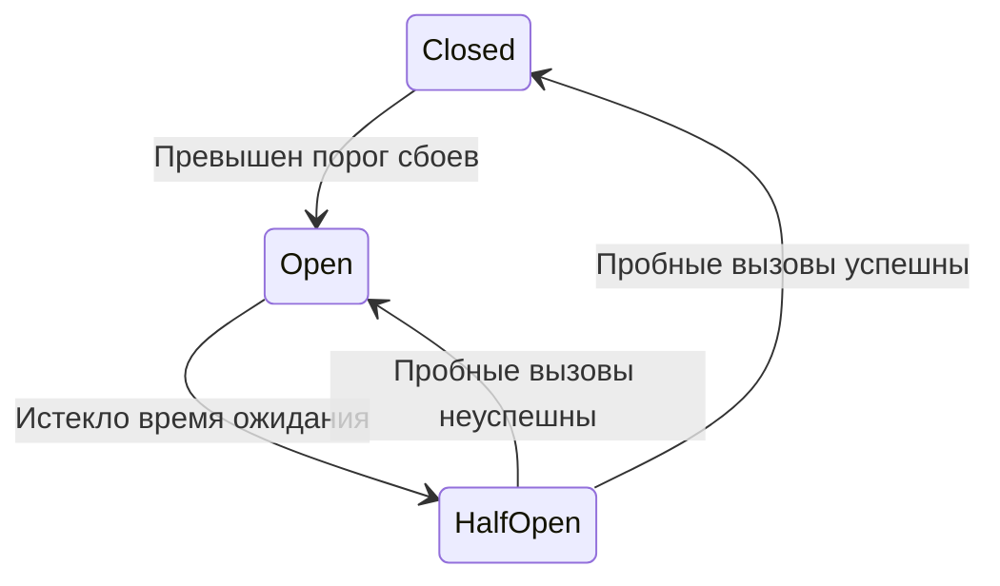

# Паттерны микросервисов

Микросервисы взаимодействуют по сети, поэтому зависимость может отвечать медленно, временно отказывать или выполнить операцию, ответ на которую потерялся. Паттерны помогают ограничить последствия этих ситуаций.

**Базис:** timeout, retry, circuit breaker и идемпотентность. Outbox и saga нужно уметь объяснить на примере, без обязательного знания конкретного фреймворка.

## Timeout: ограничить ожидание

**Timeout** — максимальное время ожидания; **deadline** — момент, после которого работа уже не нужна. В Go дедлайн передают через `context` в HTTP, gRPC и SQL.

У запроса должен быть общий бюджет, а у отдельных попыток — ограничения внутри него. Три попытки по секунде не должны превращать общий дедлайн в три секунды, если клиент готов ждать только одну.

**Таймаут не доказывает, что операция не выполнена.** Платёж мог пройти, а ответ потеряться. Отмена контекста тоже не откатывает уже зафиксированную удалённую операцию.

## Retry: повторить временно неудачную операцию

Повторы подходят для временных сбоев: недоступного соединения, части `5xx` или `429` с учётом `Retry-After` и контракта API. Ошибку валидации или отсутствие прав повторять бессмысленно.

- Ограничить число попыток и общее время.
- Использовать **exponential backoff** — растущие интервалы ожидания.
- Добавить **jitter** — случайное отклонение, чтобы клиенты не повторяли запрос одновременно.
- Прекращать попытки и ожидание при отмене контекста.
- Повторять изменяющую операцию только при безопасной семантике или ключе идемпотентности.

Если три уровня делают до трёх попыток каждый, один запрос может породить до `3 × 3 × 3 = 27` обращений к нижней зависимости. Повторы должны иметь одного понятного владельца и общий бюджет.

## Circuit breaker: временно перестать обращаться

**Circuit breaker** — автоматический предохранитель: при частых сбоях зависимости он временно отклоняет вызовы быстро, чтобы не расходовать все соединения и горутины на бесполезное ожидание.

- **Closed:** вызовы проходят, результаты учитываются.
- **Open:** вызовы сразу отклоняются, зависимость не вызывается.
- **Half-open:** разрешено ограниченное число пробных вызовов для проверки восстановления.

Breaker должен сохранять состояние между запросами; создавать новый на каждый вызов бессмысленно. Пороги, окно наблюдения и типы учитываемых ошибок настраивают под зависимость: пользовательский `404` не обязательно означает её отказ.

| Механизм | На какой вопрос отвечает |
|---|---|
| Timeout | Как долго ждать одну операцию? |
| Retry | Стоит ли попробовать ещё раз? |
| Circuit breaker | Стоит ли сейчас вообще обращаться? |
| Bulkhead | Сколько ресурсов эта зависимость может занять? |

**Bulkhead** — изоляция ресурсов, например отдельный ограниченный пул или семафор для внешнего API. Он не даёт медленной зависимости занять все доступные обработчики.

**Fallback** — допустимый альтернативный результат: например старые рекомендации. Нельзя выдавать «платёж успешен» или разрешать доступ просто потому, что проверяющий сервис недоступен.

## Идемпотентность

**Идемпотентная операция** при повторном выполнении не добавляет новый бизнес-эффект. Для создания платежа клиент может передать `Idempotency-Key`.

Сервис атомарно связывает ключ с операцией/результатом, защищает его уникальным ограничением и при повторе возвращает согласованный результат. Нужно обработать два одновременных запроса и запретить использование того же ключа с другим содержимым.

Один `GET` в Redis перед записью не решает гонку. Срок хранения ключа должен покрывать допустимое окно повторов.

## Когда операция затрагивает несколько сервисов

- **Transactional outbox:** изменение бизнес-данных и запись события в outbox фиксируют одной транзакцией БД. Отдельный worker отправляет событие в брокер. Отправка может повториться, поэтому consumer должен быть идемпотентным.
- **Saga:** последовательность локальных транзакций с компенсирующими действиями. Например резерв товара → оплата; при отказе оплаты — снять резерв. Компенсация не является настоящим rollback всех сервисов и сама может требовать повторов.
- **CQRS:** разные модели/пути записи и чтения. Полезно при отличающихся требованиях к ним, но не требует автоматически отдельных БД или event sourcing.

Для простого CRUD эти паттерны не нужно добавлять «на всякий случай». Outbox и гарантии сообщений подробнее разобраны в [конспекте о брокерах](<21. Брокеры сообщений.md>).

## Разбор отказов

| Ситуация | Что делать |
|---|---|
| Рекомендации зависли | Ограничить время и ресурсы, допустим fallback |
| Ответ платежа потерялся | Проверить результат по ID/ключу, не создавать новый платёж вслепую |
| Зависимость массово возвращает временные ошибки | Bounded retry с jitter, breaker, мониторинг |
| БД обновлена, публикация события упала | Outbox и повторная отправка |
| Сообщение пришло повторно | Атомарная дедупликация вместе с бизнес-изменением |

## Что важно на собеседовании

1. **Retry и breaker — противоположности?** Они решают разные задачи и могут сочетаться; важно не считать открытый breaker поводом для немедленных повторов.
2. **Можно ли повторить POST после timeout?** Только зная контракт; без идемпотентности возможен повторный эффект.
3. **Почему нужен jitter?** Убирает синхронную волну повторов от множества клиентов.
4. **Outbox гарантирует exactly-once?** Нет: атомарность БД и события не исключает повторную публикацию и обработку.

**Запомнить:** ограничить ожидание → безопасно повторять → прекращать бесполезные вызовы → ограничивать ресурсы → учитывать повторный эффект.

## Источники

- [Microsoft: Retry](https://learn.microsoft.com/en-us/azure/architecture/patterns/retry)
- [Microsoft: Circuit Breaker](https://learn.microsoft.com/en-us/azure/architecture/patterns/circuit-breaker)
- [Microsoft: Saga](https://learn.microsoft.com/en-us/azure/architecture/patterns/saga)
- [Microservices.io: transactional outbox](https://microservices.io/patterns/data/transactional-outbox.html)
- [Microservices.io: CQRS](https://microservices.io/patterns/data/cqrs.html)

## Видео для закрепления

1. [Микросервисная архитектура](https://www.youtube.com/watch?v=lEGFm474LKI) — рус., архитектурный контекст взаимодействия сервисов.
2. [How Circuit Breaker Pattern Works? — Java Guides](https://www.youtube.com/watch?v=3Fa0229MBY4) — англ., состояния предохранителя; принцип не зависит от языка реализации.
